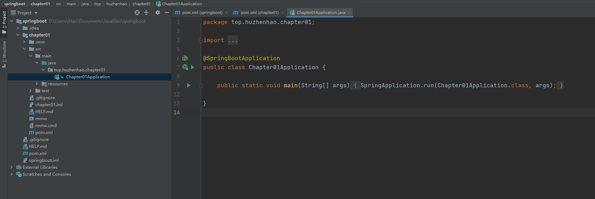

# 第一章 Spring Boot 入门

## 创建父子项目的SpringBoot项目

### 创建父项目


不选依赖创建空项目，完成后将以下红框中删掉，因为之后还创建子项目，父项目里不直接写代码。


#### 设置Maven依赖

如是第一次创建，会Maven会去下载很多依赖，所以需要等待一段时间。这里Maven默认使用了国外的源，国内的话可以手动设置阿里源。


若原本不存在setting.xml，则创建一个，然后填入以下内容：

```xml
<settings xmlns="http://maven.apache.org/SETTINGS/1.0.0"
      xmlns:xsi="http://www.w3.org/2001/XMLSchema-instance"
      xsi:schemaLocation="http://maven.apache.org/SETTINGS/1.0.0
                          https://maven.apache.org/xsd/settings-1.0.0.xsd">
      <mirrors>
        <mirror>  
            <id>alimaven</id>  
            <name>aliyun maven</name>  
            <url>http://maven.aliyun.com/nexus/content/groups/public/</url>  
            <mirrorOf>central</mirrorOf>          
        </mirror>  
      </mirrors>
</settings>
```


### 创建子项目


### 配置父项目

```xml
<?xml version="1.0" encoding="UTF-8"?>
<project xmlns="http://maven.apache.org/POM/4.0.0" xmlns:xsi="http://www.w3.org/2001/XMLSchema-instance"
         xsi:schemaLocation="http://maven.apache.org/POM/4.0.0 https://maven.apache.org/xsd/maven-4.0.0.xsd">
    <modelVersion>4.0.0</modelVersion>

    <!-- 父模块打包类型必须为pom -->
    <packaging>pom</packaging>

    <parent>
        <groupId>org.springframework.boot</groupId>
        <artifactId>spring-boot-starter-parent</artifactId>
        <version>2.4.0</version>
        <relativePath/> <!-- lookup parent from repository -->
    </parent>
    <groupId>top.huzhenhao</groupId>
    <artifactId>springboot</artifactId>
    <version>0.0.1-SNAPSHOT</version>
    <name>springbootlearning</name>
    <description>Demo project for Spring Boot</description>

    <properties>
        <java.version>1.8</java.version>
    </properties>

    <!-- 子模块 -->
    <modules>
        <module>chapter01</module>
    </modules>

    <dependencies>
        <dependency>
            <groupId>org.springframework.boot</groupId>
            <artifactId>spring-boot-starter</artifactId>
        </dependency>

        <dependency>
            <groupId>org.springframework.boot</groupId>
            <artifactId>spring-boot-starter-test</artifactId>
            <scope>test</scope>
        </dependency>
    </dependencies>

    <build>
        <plugins>
            <plugin>
                <groupId>org.springframework.boot</groupId>
                <artifactId>spring-boot-maven-plugin</artifactId>
            </plugin>
        </plugins>
    </build>

    <dependencyManagement>
        <dependencies>
            <dependency>
                <groupId>top.huzhenhao</groupId>
                <artifactId>chapter01</artifactId>
                <version>0.0.1-SNAPSHOT</version>
            </dependency>
        </dependencies>
    </dependencyManagement>

</project>
```

配置好后点击 Load Maven Changes。


### 配置子项目

```xml
<?xml version="1.0" encoding="UTF-8"?>
<project xmlns="http://maven.apache.org/POM/4.0.0" xmlns:xsi="http://www.w3.org/2001/XMLSchema-instance"
	xsi:schemaLocation="http://maven.apache.org/POM/4.0.0 https://maven.apache.org/xsd/maven-4.0.0.xsd">
	<modelVersion>4.0.0</modelVersion>

	<artifactId>chapter01</artifactId>
	<version>0.0.1-SNAPSHOT</version>
	<name>chapter01</name>
	<description>Demo project for Spring Boot</description>

	<!-- 继承本项目的父工程 -->
	<parent>
		<groupId>top.huzhenhao</groupId>
		<artifactId>springboot</artifactId>
		<version>0.0.1-SNAPSHOT</version>
	</parent>

    <!-- web依赖，若其他子项目共同需要的依赖可现在父工程里 -->
	<dependencies>
		<dependency>
			<groupId>org.springframework.boot</groupId>
			<artifactId>spring-boot-starter-web</artifactId>
		</dependency>
	</dependencies>

</project>
```


### 启动测试

添加测试接口

```java
@RestController
public class Hello {
    @GetMapping("/hello")
    public String hello(){
        return "Hello SpringBoot";
    }
}
```

点击运行即可




访问 ： http://localhost:8080/hello ，若显示 "Hello SpringBoot" 即成功。


若需要继续创建其他子项目，按上面步骤创建即可，注意需要在父项目 pom 中配置一下子模块。