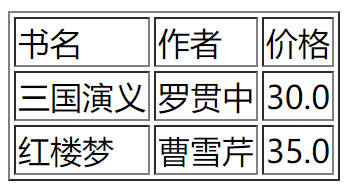

# 整合Thymeleaf


## 添加依赖

```xml
<dependencies>
    <dependency>
        <groupId>org.springframework.boot</groupId>
        <artifactId>spring-boot-starter-thymeleaf</artifactId>
    </dependency>
</dependencies>
```


## 配置Thymeleaf

```properties
#thymelea模板配置
spring.thymeleaf.cache=true
spring.thymeleaf.check-template=true
spring.thymeleaf.check-template-location=true
spring.thymeleaf.encoding=UTF-8
spring.thymeleaf.prefix=classpath:/templates/  # 模板文件位置
spring.thymeleaf.servlet.content-type=text/html
spring.thymeleaf.suffix=.html
```


## 控制器代码

```java
// Book.java
@Component
public class Book {
    private String name;
    private String author;
    private Float price;
    // ... ...
}
```

```java
// BookController.java
import org.springframework.web.bind.annotation.GetMapping;
import org.springframework.web.bind.annotation.RestController;
import org.springframework.web.servlet.ModelAndView;
import top.huzhenhao.chapter03.pojo.Book;

import java.util.ArrayList;

@RestController
public class BookController {
    @GetMapping("/books")
    public ModelAndView books(){
        ArrayList<Book> books = new ArrayList<>();
        Book book1 = new Book();
        book1.setName("三国演义");
        book1.setAuthor("罗贯中");
        book1.setPrice(30f);
        Book book2 = new Book();
        book2.setName("红楼梦");
        book2.setAuthor("曹雪芹");
        book2.setPrice(35f);
        books.add(book1);
        books.add(book2);
        ModelAndView mv = new ModelAndView();
        mv.addObject("books", books);
        mv.setViewName("books");
        return mv;
    }
}
```


## 创建视图

resources/templates/books.html

```html
<!DOCTYPE html>
<html lang="en" xmlns:th="http://www.w3.org/1999/xhtml">
<head>
    <meta charset="UTF-8">
    <title>图书列表</title>
</head>
<body>
<table border="1">
    <tr>
        <td>书名</td>
        <td>作者</td>
        <td>价格</td>
    </tr>
    <tr th:each="book:${books}">
        <td th:text="${book.name}"></td>
        <td th:text="${book.author}"></td>
        <td th:text="${book.price}"></td>
    </tr>
</table>
</body>
</html>
```


## 运行

http://localhost:8080/books

