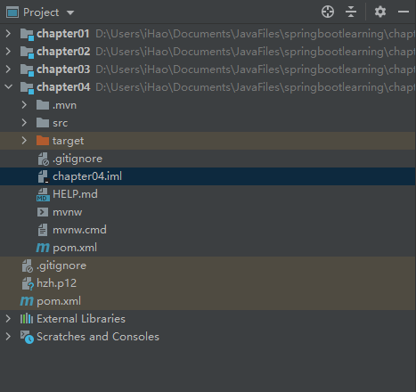
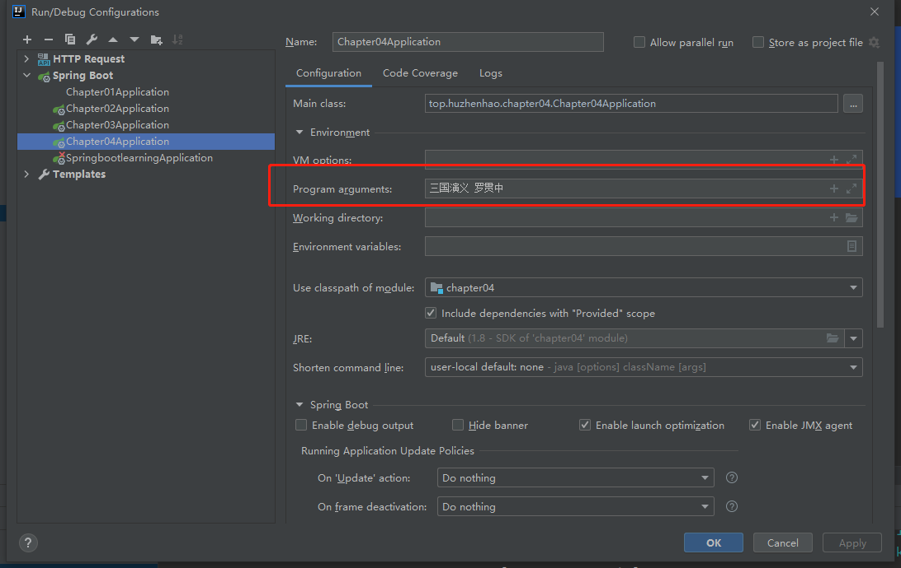

# 第四章 Spring Boot 整合 Web 开发

## 4.1 返回 JSON 数据

```java
@Component
public class Book {
    private String name;
    private String author;
    @JsonIgnore
    private Float price;
    @JsonFormat(pattern = "yyyy-MM-dd")
    private Date publishDate;
}
```


## 4.2 静态资源访问

由于我使用了父子工程的方式，一开始按书本教程操作并不能访问到图片。

后来了解到 classpath 是和 xxx.iml 文件有关系的，因为我之前建父项目时没有把父项目的 iml 文件删除，所以怀疑时父项目的 iml 文件优先级更高使得访问失败，尝试把父项目的 iml 文件删除后再访问，可以得到静态资源。



## 4.3 文件上传

html文件

```html
<!DOCTYPE html>
<html lang="en">
<head>
    <meta charset="UTF-8">
    <title>上传文件</title>
</head>
<body>
<form action="/upload" method="post" enctype="multipart/form-data">
    <input type="file" name="uploadFile" value="请选择文件">
    <!-- 若是多文件用这行 <input type="file" name="uploadFiles" value="请选择文件" multiple>-->

    <input type="submit" value="上传">
</form>
</body>
</html>
```

application.properties

```properties
# 配置文件传输
spring.servlet.multipart.enabled =true
# 文件写入磁盘的阈值
spring.servlet.multipart.file-size-threshold =0
# 文件保存的位置（不设置的话在tomcat下）
spring.servlet.multipart.location=E:\\tomcat-temp\\
# 单个数据的大小
spring.servlet.multipart.max-file-size=1MB
# 总数据的大小
spring.servlet.multipart.max-request-size=10MB
# 是否延迟解析
spring.servlet.multipart.resolve-lazily=false
```

java

```java
@RestController
@PropertySource(value = {"classpath:application.properties"})
public class FileUploadController {

    // String realPath = req.getSession().getServletContext().getRealPath("/uploadFile/");
    @Value("${spring.servlet.multipart.location}")
    String realPath;
    SimpleDateFormat sdf = new SimpleDateFormat("yyyy/MM/dd/");

    @PostMapping("/upload")
    public String upload(MultipartFile uploadFile, HttpServletRequest req) {
        String format = sdf.format(new Date());
        File folder = new File(realPath + format);
        if (!folder.isDirectory()) {
            folder.mkdirs();
        }
        // 重命名
        String oldName = uploadFile.getOriginalFilename();
        String newName = UUID.randomUUID().toString() + oldName.substring(oldName.lastIndexOf("."), oldName.length());
        try{
            // 保存文件
            uploadFile.transferTo(new File(folder, newName));
            // 生成访问路径
            return req.getScheme() + "://" + req.getServerName() + ":" + req.getServerPort() + "/uploadFile/" + format + newName;
        } catch (IOException e) {
            e.printStackTrace();
        }
        return "上传失败！";
    }

    @PostMapping("/uploads")
    public String uploads(MultipartFile[] uploadFiles, HttpServletRequest req) {
        String format = sdf.format(new Date());
        File folder = new File(realPath + format);
        if (!folder.isDirectory()) {
            folder.mkdirs();
        }
        // 循环依次保存
        for (MultipartFile uploadFile : uploadFiles) {
            String oldName = uploadFile.getOriginalFilename();
            String newName = UUID.randomUUID().toString() + oldName.substring(oldName.lastIndexOf("."), oldName.length());
            try{
                uploadFile.transferTo(new File(folder, newName));
            } catch (IOException e) {
                e.printStackTrace();
                return "上传失败！";
            }
        }
        return "上传成功！";
    }

}

```


## 4.4 ControllerAdvice

### 全局异常处理

```java
@ControllerAdvice
public class CustomExceptionHandler {
    @ExceptionHandler(MaxUploadSizeExceededException.class)
    public void uploadException(MaxUploadSizeExceededException e, HttpServletResponse resp) throws IOException {
        resp.setContentType("text/html;charset=utf-8");
        PrintWriter out = resp.getWriter();
        out.write("超出文件大小限制");
        out.flush();
        out.close();
    }
}
```

### 全局参数

```java
@ControllerAdvice
public class GlobalConfig {
    @ModelAttribute(value = "info1")
    public Map<String, String> userInfo1(){
        HashMap<String, String> map = new HashMap<>();
        map.put("username", "张三");
        map.put("gender", "男");
        return map;
    }
    @ModelAttribute(value = "info2")
    public String userInfo2(){
        return "张三";
    }
}
```

```java
@Controller
public class HelloController {
    @GetMapping("/hello")
    @ResponseBody
    public void hello(Model model) {
        Map<String, Object> map = model.asMap();
        Set<String> keySet = map.keySet();
        for (String key : keySet) {
            Object value = map.get(key);
            System.out.println(key + ">>>>>>>" + value);
        }
    }
}
// 输出：
info1>>>>>>>{gender=男, username=张三}
info2>>>>>>>张三
```

## 4.5 配置错误页


```xml
<!DOCTYPE html>
<html lang="en" xmlns:th="http://www.w3.org/1999/xhtml">
<head>
    <meta charset="UTF-8">
    <title>Title</title>
</head>
<body>
    <table border="1">
        <tr>
            <td>时间</td>
            <td th:text="${timestamp}"></td>
        </tr>
        <tr>
            <td>status</td>
            <td th:text="${status}"></td>
        </tr>
        <tr>
            <td>error</td>
            <td th:text="${error}"></td>
        </tr>
        <tr>
            <td>message</td>
            <td th:text="${message}"></td>
        </tr>
        <tr>
            <td>path</td>
            <td th:text="${path}"></td>
        </tr>
    </table>
</body>
</html>
```


## 4.6 跨域

### 注解方式

```java
@PostMapping("/addbook")
@CrossOrigin(value = "http://localhost:8080", maxAge = 1800, allowedHeaders = "*")
public String addBook(String name){
    return "receive:" + name;
}

@GetMapping("/getbook")
@CrossOrigin(value = "http://localhost:8080", maxAge = 1800, allowedHeaders = "*")
public String getBook(){
    return "receive: GET";
}

@DeleteMapping("/book/{id}")
@CrossOrigin(value = "http://localhost:8080", maxAge = 1800, allowedHeaders = "*")
public String deleteBookById(@PathVariable Long id){
    return String.valueOf(id);
}
```

### 全局配置

```java
@Configuration
public class MyWebMvcConfig implements WebMvcConfigurer {
    @Override
    public void addCorsMappings(CorsRegistry registry) {
        registry.addMapping("/**")
                .allowedHeaders("*")
                .allowedMethods("*")
                .maxAge(1800)
                .allowedOrigins("http://localhost:8080");
    }
}
```


## 4.8 注册拦截器

### 实现HandlerInterceptor接口

```java
public class MyInterceptor implements HandlerInterceptor {
    @Override
    public boolean preHandle(HttpServletRequest request, HttpServletResponse response, Object handler) throws Exception {
        System.out.println("MyInterceptor>>>preHandle");
        return true;
    }

    @Override
    public void postHandle(HttpServletRequest request, HttpServletResponse response, Object handler, ModelAndView modelAndView) throws Exception {
        System.out.println("MyInterceptor>>>postHandle");
    }

    @Override
    public void afterCompletion(HttpServletRequest request, HttpServletResponse response, Object handler, Exception ex) throws Exception {
        System.out.println("MyInterceptor>>>afterCompletion");
    }
}
```

### 配置拦截器

```java
@Configuration
public class MyWebMvcConfig implements WebMvcConfigurer {
    @Override
    public void addInterceptors(InterceptorRegistry registry) {
        registry.addInterceptor(new MyInterceptor())
                .addPathPatterns("/**")  // 拦截路径
                .excludePathPatterns("/hello");  // 排除的路径
    }
}
```


## 4.9 启动系统任务

### CommandLineRunner

```java
@Component
@Order(1)  // 数字越小越优先
public class MyCommandLineRunner1 implements CommandLineRunner {
    @Override
    public void run(String... args) throws Exception {
        System.out.println("MyCommandLineRunner1>>>" + Arrays.toString(args));
    }
}

@Component
@Order(2)  // 数字越小越优先
public class MyCommandLineRunner2 implements CommandLineRunner {
    @Override
    public void run(String... args) throws Exception {
        System.out.println("MyCommandLineRunner2>>>" + Arrays.toString(args));
    }
}
```



启动时输出：

```bash
2020-11-29 10:26:09.263  INFO 16120 --- [           main] t.h.chapter04.Chapter04Application       : Started Chapter04Application in 1.327 seconds (JVM running for 2.041)
MyCommandLineRunner1>>>[三国演义, 罗贯中]
MyCommandLineRunner2>>>[三国演义, 罗贯中]
```

### ApplicationRunner

```java
@Component
@Order(1)  // 数字越小越优先
public class MyApplicationRunner implements ApplicationRunner {
    @Override
    public void run(ApplicationArguments args) throws Exception {  // 与 CommandLineRunner 区别在于run方法的参数上
        List<String> nonOptionArgs = args.getNonOptionArgs();
        System.out.println("nonOptionArgs>>>"+nonOptionArgs);
        Set<String> optionNames = args.getOptionNames();
        for (String optionName : optionNames) {
            System.out.println("Key:" + optionName + ";value:" + args.getOptionValues(optionName));
        }
    }
}
```


## 4.12 AOP

### 依赖

```xml
<dependency>
    <groupId>org.springframework.boot</groupId>
    <artifactId>spring-boot-starter-aop</artifactId>
</dependency>
```

### 服务

```java
@Service
public class UserService {
    public String getUserById(Integer id) {
        System.out.println("get...");
        return "user";
    }
}
```

### 切面

```java
@Component
@Aspect
public class LogAspect {
    @Pointcut("execution(* top.huzhenhao.chapter04.service.*.*(..))")
    public void pc1(){}

    @Before(value = "pc1()")
    public void before(JoinPoint jp) {
        String name = jp.getSignature().getName();
        System.out.println(name + "方法开始执行...");
    }

    @After(value = "pc1()")
    public void after(JoinPoint jp) {
        String name = jp.getSignature().getName();
        System.out.println(name + "方法执行结束...");
    }

    @AfterReturning(value = "pc1()", returning = "result")
    public void afterReturning(JoinPoint jp, Object result) {
        String name = jp.getSignature().getName();
        System.out.println(name + "方法返回值为：" + result);
    }

    @AfterThrowing(value = "pc1()", throwing = "e")
    public void afterThrowing(JoinPoint jp, Exception e) {
        String name = jp.getSignature().getName();
        System.out.println(name + "方法抛出异常为：" + e);
    }

    @Around("pc1()")
    public Object around(ProceedingJoinPoint pjp) throws Throwable {
        return pjp.proceed();
    }
}
```

### 测试

```java
@RestController
public class UserController {
    @Autowired
    UserService userService;
    @GetMapping("/getUser")
    public String getUserById(Integer id) {
        System.out.println("UserController>>>getUserById");
        return userService.getUserById(id);
    }
}
// 访问 http://localhost:8082/getUser 输出：
MyInterceptor>>>preHandle
UserController>>>getUserById
getUserById方法开始执行...
get...
getUserById方法返回值为：user
getUserById方法执行结束...
MyInterceptor>>>postHandle
MyInterceptor>>>afterCompletion
```


