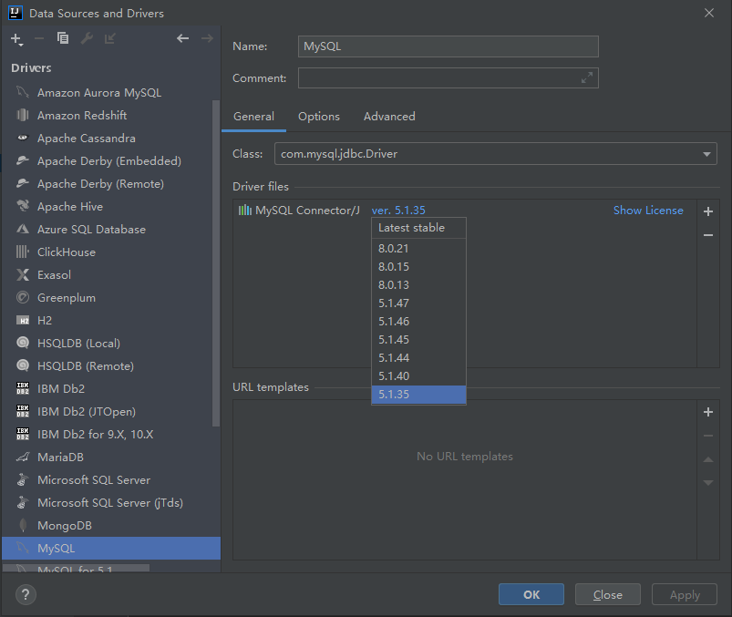

# 第五章 Spring Boot 整合持久层技术

## 5.1 整合 JdbcTemplate

### 创建数据

```sql
USE `study`;
CREATE TABLE `book` (
	`id` INT(11) NOT NULL AUTO_INCREMENT,
	`name` VARCHAR(128) NOT NULL DEFAULT '' COMMENT '书名',
	`author` VARCHAR(64) NOT NULL DEFAULT '' COMMENT '作者',
	PRIMARY KEY (`id`) USING BTREE
) COMMENT='书表' ENGINE=InnoDB AUTO_INCREMENT=1;
INSERT INTO book (id,name,author) VALUES (1, '三国演义', '罗贯中'), (2, '水浒传', '施耐庵');
```

连接测试，Idea默认配置连接MySQL时出错，改为以下版本可




### 新建项目，添加依赖

```xml
<dependencies>
    <dependency>
        <groupId>org.springframework.boot</groupId>
        <artifactId>spring-boot-starter-jdbc</artifactId>
    </dependency>
    <dependency>
        <groupId>mysql</groupId>
        <artifactId>mysql-connector-java</artifactId>
    </dependency>
    <dependency>
        <groupId>com.alibaba</groupId>
        <artifactId>druid</artifactId>
        <version>1.1.10</version>
    </dependency>
</dependencies>
```

### 数据库配置

```properties
spring.datasource.type=com.alibaba.druid.pool.DruidDataSource
# spring.datasource.url=jdbc:mysql://59.78.194.153:3306/study
spring.datasource.url=jdbc:mysql://59.78.194.153:3306/study?useUnicode=true&characterEncoding=utf8&useSSL=false&serverTimezone=Hongkong
spring.datasource.username=root
spring.datasource.password=123456
```

### 创建实体类

```java
public class Book {
    private Integer id;
    private String name;
    private String author;
}
```

### 数据访问层

```java
@Repository
public class BookDao {
    @Autowired
    JdbcTemplate jdbcTemplate;
    public int addBook(Book book){
        return jdbcTemplate.update("INSERT INTO book(name, author) VALUES (?,?)",
                book.getName(), book.getAuthor());
    }
    public int updateBook(Book book){
        return jdbcTemplate.update("UPDATE book SET name=?, author=? WHERE id=?",
                book.getName(), book.getAuthor(), book.getId());
    }
    public int deleteBook(Integer id){
        return jdbcTemplate.update("DELETE FROM book WHERE id=?", id);
    }
    public Book getBookById(Integer id){
        return jdbcTemplate.queryForObject("SELECT * FROM book WHERE id=?",
                new BeanPropertyRowMapper<>(Book.class), id);
    }
    public List<Book> getAllBooks(){
        return jdbcTemplate.query("SELECT * FROM book",
                new BeanPropertyRowMapper<>(Book.class));
    }
}
```

### 服务层

```java 
@Service
public class BookService {
    @Autowired
    BookDao bookDao;

    public int addBook(Book book) {
        return bookDao.addBook(book);
    }
    public int updateBook(Book book) {
        return bookDao.updateBook(book);
    }
    public int deleteBook(Integer id) {
        return bookDao.deleteBook(id);
    }
    public Book getBookById(Integer id) {
        return bookDao.getBookById(id);
    }
    public List<Book> getAllBooks(){
        return bookDao.getAllBooks();
    }
}
```

### 控制层

```java
@RestController
public class BookController {
    @Autowired
    BookService bookService;

    @GetMapping("/{id}")
    public void getBook(@PathVariable Integer id){
        Book book = bookService.getBookById(id);
        System.out.println("getBookById>>>" + book.toString());
    }

    @GetMapping("/bookOps")
    public void bookOps(){
        Book book1 = new Book();
        book1.setName("西厢记");
        book1.setAuthor("王实甫");
        int i = bookService.addBook(book1);  // 其他接口省略没测
        System.out.println("addBook>>>" + i);
        List<Book> allBooks = bookService.getAllBooks();
        for (Book book : allBooks) {
            System.out.println("getAllBooks>>>" + book.toString());
        }
    }
}
```

### 测试

访问 http://localhost:8080/bookOps 

报错：

```bash
2020-11-29 21:58:46.499 ERROR 20612 --- [eate-1152340022] com.alibaba.druid.pool.DruidDataSource   : create connection SQLException, url: jdbc:mysql://59.78.194.153:3306, errorCode 0, state 08S01

com.mysql.cj.jdbc.exceptions.CommunicationsException: Communications link failure

The last packet sent successfully to the server was 0 milliseconds ago. The driver has not received any packets from the server.
	at com.mysql.cj.jdbc.exceptions.SQLError.createCommunicationsException(SQLError.java:174) ~[mysql-connector-java-8.0.22.jar:8.0.22]
	at com.mysql.cj.jdbc.exceptions.SQLExceptionsMapping.translateException(SQLExceptionsMapping.java:64) ~[mysql-connector-java-8.0.22.jar:8.0.22]
	at com.mysql.cj.jdbc.ConnectionImpl.createNewIO(ConnectionImpl.java:836) ~[mysql-connector-java-8.0.22.jar:8.0.22]
	at com.mysql.cj.jdbc.ConnectionImpl.<init>(ConnectionImpl.java:456) ~[mysql-connector-java-8.0.22.jar:8.0.22]
	at com.mysql.cj.jdbc.ConnectionImpl.getInstance(ConnectionImpl.java:246) ~[mysql-connector-java-8.0.22.jar:8.0.22]
	at com.mysql.cj.jdbc.NonRegisteringDriver.connect(NonRegisteringDriver.java:198) ~[mysql-connector-java-8.0.22.jar:8.0.22]
	at com.alibaba.druid.pool.DruidAbstractDataSource.createPhysicalConnection(DruidAbstractDataSource.java:1558) ~[druid-1.1.10.jar:1.1.10]
	at com.alibaba.druid.pool.DruidAbstractDataSource.createPhysicalConnection(DruidAbstractDataSource.java:1623) ~[druid-1.1.10.jar:1.1.10]
	at com.alibaba.druid.pool.DruidDataSource$CreateConnectionThread.run(DruidDataSource.java:2468) ~[druid-1.1.10.jar:1.1.10]
Caused by: com.mysql.cj.exceptions.CJCommunicationsException: Communications link failure
```

解决方法: 配置文件数据库连接URL添加后缀

```properties
spring.datasource.url=jdbc:mysql://59.78.194.153:3306/study?useUnicode=true&characterEncoding=utf8&useSSL=false&serverTimezone=Hongkong
```

访问成功

```bash
addBook>>>1
getAllBooks>>>Book{id=1, name='三国演义', author='罗贯中'}
getAllBooks>>>Book{id=2, name='水浒传', author='施耐庵'}
getAllBooks>>>Book{id=3, name='西厢记', author='王实甫'}  # 代码新插入的数据
```

## 5.2 整合MyBatis

### 依赖

```xml
<-- 省略上一步已经配置的 -->
<dependency>
    <groupId>org.mybatis.spring.boot</groupId>
    <artifactId>mybatis-spring-boot-starter</artifactId>
    <version>2.1.3</version>
</dependency>
```

### 数据访问层

使用了MybatisPlus插件生成

```java
@Mapper
public interface BookMapper {
    int deleteByPrimaryKey(Integer id);
    int insert(Book record);
    int insertSelective(Book record);
    Book selectByPrimaryKey(Integer id);
    List<Book> getAllBooks();  // 手动新增方法
    int updateByPrimaryKeySelective(Book record);
    int updateByPrimaryKey(Book record);
}
```

```xml
<?xml version="1.0" encoding="UTF-8"?>
<!DOCTYPE mapper PUBLIC "-//mybatis.org//DTD Mapper 3.0//EN" "http://mybatis.org/dtd/mybatis-3-mapper.dtd">
<mapper namespace="top.huzhenhao.chapter05.Repository.BookMapper">
  <resultMap id="BaseResultMap" type="top.huzhenhao.chapter05.pojo.Book">
    <id column="id" jdbcType="INTEGER" property="id" />
    <result column="name" jdbcType="VARCHAR" property="name" />
    <result column="author" jdbcType="VARCHAR" property="author" />
  </resultMap>
  <sql id="Base_Column_List">
    id, `name`, author
  </sql>
  <select id="selectByPrimaryKey" parameterType="java.lang.Integer" resultMap="BaseResultMap">
    select 
    <include refid="Base_Column_List" />
    from book
    where id = #{id,jdbcType=INTEGER}
  </select>
  <select id="getAllBooks" resultMap="BaseResultMap">
    select * from book
  </select>
  <delete id="deleteByPrimaryKey" parameterType="java.lang.Integer">
    delete from book
    where id = #{id,jdbcType=INTEGER}
  </delete>
  <insert id="insert" keyColumn="id" keyProperty="id" parameterType="top.huzhenhao.chapter05.pojo.Book" useGeneratedKeys="true">
    insert into book (`name`, author)
    values (#{name,jdbcType=VARCHAR}, #{author,jdbcType=VARCHAR})
  </insert>
  <insert id="insertSelective" keyColumn="id" keyProperty="id" parameterType="top.huzhenhao.chapter05.pojo.Book" useGeneratedKeys="true">
    insert into book
    <trim prefix="(" suffix=")" suffixOverrides=",">
      <if test="name != null">
        `name`,
      </if>
      <if test="author != null">
        author,
      </if>
    </trim>
    <trim prefix="values (" suffix=")" suffixOverrides=",">
      <if test="name != null">
        #{name,jdbcType=VARCHAR},
      </if>
      <if test="author != null">
        #{author,jdbcType=VARCHAR},
      </if>
    </trim>
  </insert>
  <update id="updateByPrimaryKeySelective" parameterType="top.huzhenhao.chapter05.pojo.Book">
    update book
    <set>
      <if test="name != null">
        `name` = #{name,jdbcType=VARCHAR},
      </if>
      <if test="author != null">
        author = #{author,jdbcType=VARCHAR},
      </if>
    </set>
    where id = #{id,jdbcType=INTEGER}
  </update>
  <update id="updateByPrimaryKey" parameterType="top.huzhenhao.chapter05.pojo.Book">
    update book
    set `name` = #{name,jdbcType=VARCHAR},
      author = #{author,jdbcType=VARCHAR}
    where id = #{id,jdbcType=INTEGER}
  </update>
</mapper>
```


### 服务层

```java
@Service
public class BookMapperService {
    @Autowired
    BookMapper bookMapper;

    public int addBook(Book book) {
        return bookMapper.insert(book);
    }
    public int updateBook(Book book) {
        return bookMapper.updateByPrimaryKey(book);
    }
    public int deleteBook(Integer id) {
        return bookMapper.deleteByPrimaryKey(id);
    }
    public Book getBookById(Integer id) {
        return bookMapper.selectByPrimaryKey(id);
    }
    public List<Book> getAllBooks(){
        return bookMapper.getAllBooks();
    }
}
```

### 控制层

代码与之前一样，使用的`Service`换成`BookMapperService`

### ***配置Pom**

父项目或子项目的pom.xml 中添加都可以；关键步骤，不配置的话无法访问到`BookMapper.xml`，以至无法调用数据层

```xml
<build>
    <resources>
        <resource>
            <directory>src/main/java</directory>
            <includes>
                <include>**/*.properties</include>
                <include>**/*.xml</include>
            </includes>
            <filtering>false</filtering>
        </resource>
        <resource>
            <directory>src/main/resources</directory>
            <includes>
                <include>**/*.properties</include>
                <include>**/*.xml</include>
            </includes>
            <filtering>false</filtering>
        </resource>
    </resources>
</build>
```

