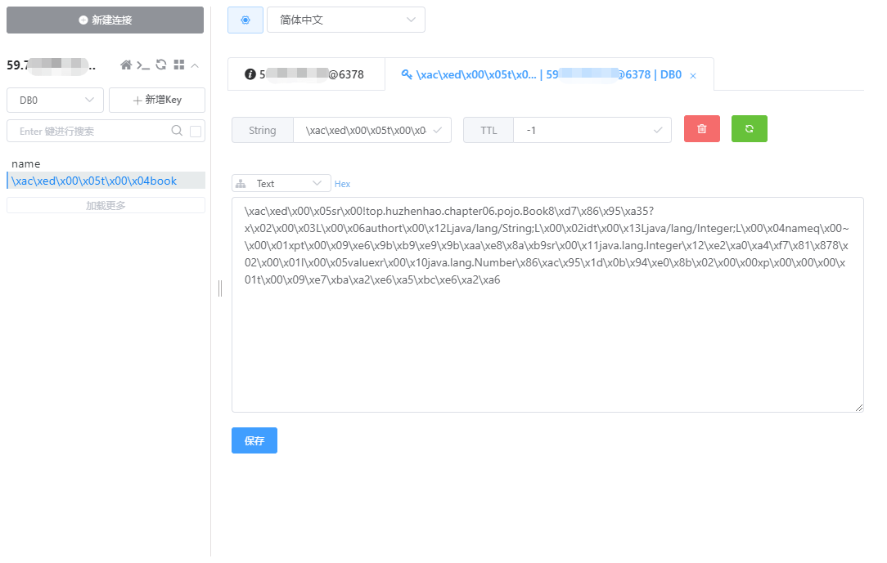
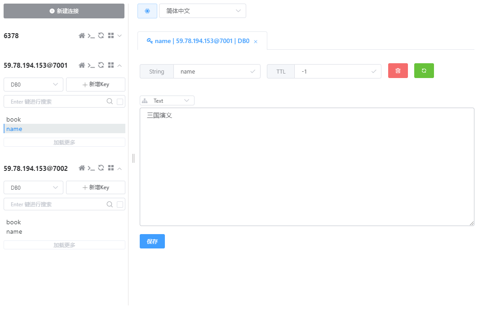
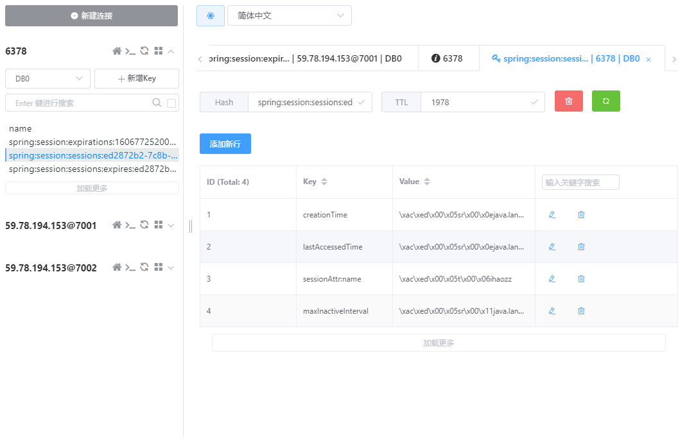

# 第六章 Spring Boot 整合NoSQL

## 6.1.1 整合Redis

### 安装Redis

参考： https://huzhenhao.top/2020/11/30/Docker%E9%87%8C%E5%AE%89%E8%A3%85%E4%BD%BF%E7%94%A8Redis/

### 创建项目添加依赖

```xml
<dependencies>
    <dependency>
        <groupId>org.springframework.boot</groupId>
        <artifactId>spring-boot-starter-data-redis</artifactId>
    </dependency>
</dependencies>
```

### 配置

```properties
# REDIS (RedisProperties)
# Redis数据库索引（默认为0）
spring.redis.database=0
# Redis服务器地址
spring.redis.host=59.xx
# Redis服务器连接端口
spring.redis.port=6378
# Redis服务器连接密码（默认为空）
spring.redis.password=1xx
# 连接池最大连接数（使用负值表示没有限制）
spring.redis.pool.max-active=8
# 连接池最大阻塞等待时间（使用负值表示没有限制）
spring.redis.pool.max-wait=-1
# 连接池中的最大空闲连接
spring.redis.pool.max-idle=8
# 连接池中的最小空闲连接
spring.redis.pool.min-idle=0
# 连接超时时间（毫秒）
spring.redis.timeout=0
```

### 实体类

```java
public class Book implements Serializable {
    private Integer id;
    private String name;
    private String author;
}
```

### 控制层

```java 
@RestController
public class BookController {
    @Autowired
    RedisTemplate redisTemplate;
    @Autowired
    StringRedisTemplate stringRedisTemplate;
    @GetMapping("/t1")
    public void getBook(){
        ValueOperations<String, String> ops1 = stringRedisTemplate.opsForValue();
        ops1.set("name", "三国演义");
        String name = ops1.get("name");
        System.out.println("name:" + name);
        ValueOperations ops2 = redisTemplate.opsForValue();
        Book book = new Book();
        book.setId(1);
        book.setName("红楼梦");
        book.setAuthor("曹雪芹");
        ops2.set("book", book);
        Book book1 = (Book) ops2.get("book");
        System.out.println("book1:" + book1);
    }
}
```

### 测试

访问：http://localhost:8080/t1

```bash
name:三国演义
book1:Book{id=1, name='红楼梦', author='曹雪芹'}
```




## 6.1.2 整合Redis集群

### 搭建Redis集群

没看参考书上，而是使用了Docker，[笔记见此](https://huzhenhao.top/2020/11/30/Docker%E6%90%AD%E5%BB%BARedis%E9%9B%86%E7%BE%A4/)

### 依赖

```xml
<dependencies>
    <dependency>
        <groupId>org.springframework.boot</groupId>
        <artifactId>spring-boot-starter-web</artifactId>
    </dependency>
    <dependency>
        <groupId>org.springframework.boot</groupId>
        <artifactId>spring-boot-starter-data-redis</artifactId>
    </dependency>
    <dependency>
        <groupId>redis.clients</groupId>
        <artifactId>jedis</artifactId>
    </dependency>
    <dependency>
        <groupId>org.springframework.data</groupId>
        <artifactId>spring-data-redis</artifactId>
    </dependency>
    <dependency>
        <groupId>org.apache.commons</groupId>
        <artifactId>commons-pool2</artifactId>
    </dependency>
</dependencies>
```

### 配置文件

使用了application.yml ，不是 .properties

```yml
spring:
  redis:
    cluster:
      ports:
        - 7001
        - 7002
        - 7003
        - 7004
        - 7005
        - 7006
      host: 59.78.194.153
      poolConfig:
        max-total: 8
        max-idle: 8
        max-wait-millis: -1
        min-idle: 0
```

### 配置Redis

RedisConfig.java

```java
@Configuration
@ConfigurationProperties("spring.redis.cluster")
public class RedisConfig {
    List<Integer> ports;
    String host;
    JedisPoolConfig poolConfig;
    @Bean
    RedisClusterConfiguration redisClusterConfiguration(){
        RedisClusterConfiguration configuration = new RedisClusterConfiguration();
        List<RedisNode> nodes = new ArrayList<>();
        for (Integer port : ports) {
            nodes.add(new RedisNode(host, port));
        }
        // configuration.setPassword(RedisPassword.of(“xxx”));  // 没有密码
        configuration.setClusterNodes(nodes);
        return configuration;
    }
    @Bean
    JedisConnectionFactory jedisConnectionFactory(){
        JedisConnectionFactory factory = new JedisConnectionFactory(redisClusterConfiguration(), poolConfig);
        return factory;
    }
    @Bean
    RedisTemplate redisTemplate(){
        RedisTemplate redisTemplate = new RedisTemplate();
        redisTemplate.setConnectionFactory(jedisConnectionFactory());
        redisTemplate.setKeySerializer(new StringRedisSerializer());
        redisTemplate.setValueSerializer(new JdkSerializationRedisSerializer());
        return redisTemplate;
    }
    @Bean
    StringRedisTemplate stringRedisTemplate(){
        StringRedisTemplate stringRedisTemplate = new StringRedisTemplate(jedisConnectionFactory());
        stringRedisTemplate.setKeySerializer(new StringRedisSerializer());
        stringRedisTemplate.setValueSerializer(new StringRedisSerializer());
        return stringRedisTemplate;
    }
	// getter() and setter()
}

```

### 控制层

代码同前

### 测试

访问 http://localhost:8080/t1 后，看redis数据库情况



## 6.2 整合MongoDB

todo

## 6.3 Session共享

### 6.3.1 Session共享配置

#### 依赖

```xml
<dependency>
    <groupId>org.springframework.boot</groupId>
    <artifactId>spring-boot-starter-data-redis</artifactId>
    <exclusions>
        <exclusion>
            <groupId>io.lettuce</groupId>
            <artifactId>lettuce-core</artifactId>
        </exclusion>
    </exclusions>
</dependency>
<dependency>
    <groupId>redis.clients</groupId>
    <artifactId>jedis</artifactId>
</dependency>
<dependency>
    <groupId>org.springframework.session</groupId>
    <artifactId>spring-session-data-redis</artifactId>
</dependency>
```

#### Redis配置

同[6.1.1 配置](### 配置)

#### 控制层

```java
@RestController
public class HelloController {
    @Value("${server.port}")  // 要在application.propertise中也配一下，不然打包会失败
    String port;

    @GetMapping("/save")  // 与书上不同换成GET，方便直接浏览器测试
    public String saveName(String name, HttpSession session) {
        session.setAttribute("name", name);
        return port;
    }

    @GetMapping("/get")
    public String getName(HttpSession session) {
        return port + ":" + session.getAttribute("name").toString();
    }
}

```

#### 运行

用maven打包，然后把jar包放在下一步配好 Nginx 的服务器上运行

```bash
java -jar chapter06-0.0.1-SNAPSHOT.jar --server.port=8080
java -jar chapter06-0.0.1-SNAPSHOT.jar --server.port=8081
```


### 6.3. 2 安装Nginx

#### yum 安装

安装成功，但是上一步测试没有成功，502 网关错误（应该和nginx配置没有关系，错在我最初把服务起在自己的机器上，跨域了可能）；当时不确定是不是nginx安装不对导致，所以后来又换了源码安装尝试。

##### 1. 安装 Nginx

yum 安装 nginx 非常简单，就输入一条命令即可。

```bash
$ sudo yum -y install nginx   # 安装 nginx
$ sudo yum remove nginx  # 卸载 nginx
```

使用 yum 进行 Nginx 安装时，Nginx 配置文件在 `/etc/nginx` 目录下。

##### 2. 配置 Nginx 服务

```bash
$ sudo systemctl enable nginx # 设置开机启动 
$ sudo service nginx start # 启动 nginx 服务
$ sudo service nginx stop # 停止 nginx 服务
$ sudo service nginx restart # 重启 nginx 服务
$ sudo service nginx reload # 重新加载配置，一般是在修改过 nginx 配置文件时使用。
```


#### 源码安装

##### 安装

官网地址：[http://www.nginx.org](http://www.nginx.org/)

```bash
# 下载源码
(base) [root@localhost nginx]# wget http://nginx.org/download/nginx-1.19.5.tar.gz
# 解压
(base) [root@localhost nginx]# tar -zxvf nginx-1.19.5.tar.gz
# 编译安装
(base) [root@localhost nginx]# cd nginx-1.19.5/
(base) [root@localhost nginx-1.19.5]# ./configure
(base) [root@localhost nginx-1.19.5]# make
(base) [root@localhost nginx-1.19.5]# make install
# 启动
(base) [root@localhost nginx-1.19.5]# /usr/local/nginx/sbin/nginx
```

此时可访问 ip 看

##### 修改配置

```bash
(base) [root@localhost nginx-1.19.5]# cd /usr/local/nginx/conf
(base) [root@localhost conf]# vim nginx.conf
...
    upstream hzh {
        server 59.78.194.153:8080 weight=1;
        server 59.78.194.153:8081 weight=1;
    }
    server {
        listen       80;
        server_name  localhost;
        location / {
            proxy_pass http://hzh;
            proxy_redirect default;
        }
```

##### 重启Nginx

```bash
(base) [root@localhost conf]# /usr/local/nginx/sbin/nginx -s reload
```


### 6.3.3 请求测试

```bash
# 访问 http://59.78.194.153/save?name=ihaozz
8081

# 访问 http://59.78.194.153/get
8080:ihaozz
```

调用 /sava 接口，Nginx转发给 8081 端口的服务器处理，再次调用 /get 接口时，8080 端口服务器返回数据。证明了Session共享的。



