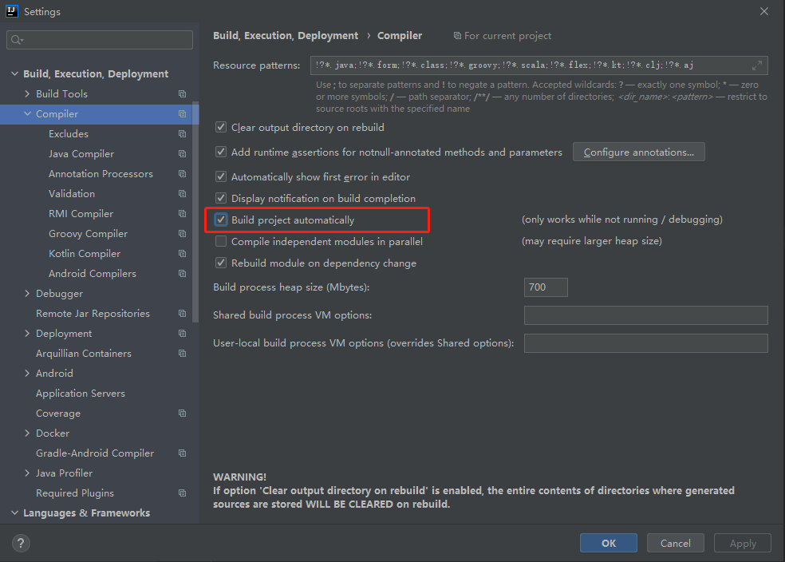
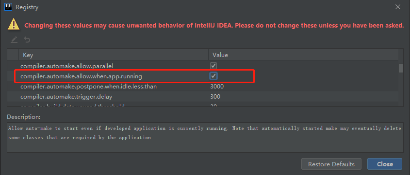

# 第八章 开发者工具与单元测试

## 8.2 devtools实战

```xml
<dependencies>
    <dependency>
        <groupId>org.springframework.boot</groupId>
        <artifactId>spring-boot-devtools</artifactId>
        <!-- optional true 应用打包后将自动禁用-->
        <optional>true</optional>
    </dependency>
</dependencies>
```






## 8.3 单元测试

依赖

```xml
<dependency>
    <groupId>junit</groupId>
    <artifactId>junit</artifactId>
    <scope>test</scope>
</dependency>
```

### Service测试

```java
@Service
public class HelloService {
    public String sayHello(String name){
        return "Hello " + name + "!";
    }
}
```

```java
@SpringBootTest
class Chapter08ApplicationTests {
	@Autowired
	HelloService helloService;
	@Test
	void contextLoads() {
		String hello = helloService.sayHello("iHaozz");
		Assert.assertEquals(hello, "Hello iHaozz!");  // import org.junit.Assert;
	}
}
```

### Controller测试

```java
@RestController
public class HelloController {
    @GetMapping("/hello")
    public String hello(String name){
        return "Hello " + name + "!";
    }
    @PostMapping("/book")
    public String addBook(@RequestBody Book book) {
        return book.toString();
    }
}
```

```java
@SpringBootTest
class HelloControllerTest {
    @Autowired
    HelloService helloService;
    @Autowired
    WebApplicationContext wac;
    MockMvc mockMvc;
    /**
     * 在新版本中，spring-boot用的是junit 5.x
     * 在junit4.x版本之前，生效的是@Before注解
     * 然而在junit 5.x中，@Before注解被@BeforeEach所替代
     */
    @BeforeEach
    public void before(){
        mockMvc = MockMvcBuilders.webAppContextSetup(wac).build();
    }
    @Test
    void hello() throws Exception {
         MvcResult mvcResult = mockMvc.perform(
                 MockMvcRequestBuilders
                         .get("/hello")
                         .contentType(MediaType.APPLICATION_FORM_URLENCODED)
                         .param("name", "iHaozz"))
                 .andExpect(MockMvcResultMatchers.status().isOk())
                 .andDo(MockMvcResultHandlers.print())
                 .andReturn();
         System.out.println(mvcResult.getResponse().getContentAsString());
    }
    @Test
    void addBook() throws Exception {
        ObjectMapper om = new ObjectMapper();
        Book book = new Book();
        book.setId(1);
        book.setName("三国演义");
        book.setAuthor("罗贯中");
        String s = om.writeValueAsString(book);
        MvcResult mvcResult = mockMvc.perform(
                MockMvcRequestBuilders
                        .post("/book")
                        .contentType(MediaType.APPLICATION_JSON)
                        .content(s))
                .andExpect(MockMvcResultMatchers.status().isOk())
                .andReturn();
        System.out.println(mvcResult.getResponse().getContentAsString());
    }
}
```

### JSON测试

```java
import org.assertj.core.api.Assertions;
import org.junit.Test;
import org.junit.runner.RunWith;
import org.springframework.beans.factory.annotation.Autowired;
import org.springframework.boot.test.autoconfigure.json.JsonTest;
import org.springframework.boot.test.json.JacksonTester;
import org.springframework.test.context.junit4.SpringRunner;
import top.huzhenhao.chapter08.pojo.Book;

import java.io.IOException;

@RunWith(SpringRunner.class)
@JsonTest
public class JSONTest {
    @Autowired
    JacksonTester<Book> jacksonTester;
    @Test
    public void testSerialize() throws IOException {
        Book book = new Book();
        book.setId(1);
        book.setName("三国演义");
        book.setAuthor("罗贯中");
        Assertions.assertThat(jacksonTester.write(book))
                .isEqualToJson("book.json");
//        Assertions.assertThat(jacksonTester.write(book))
//                .hasJsonPathStringValue("@.name");
//        Assertions.assertThat(jacksonTester.write(book))
//                .extractingJsonPathStringValue("@.name")
//                .isEqualTo("book.json");
    }
    @Test
    public void testDeserialize() throws Exception {
        String content = "{\"id\": 1, \"name\": \"三国演义\", \"author\": \"罗贯中\"}";
        Assertions.assertThat(jacksonTester.parseObject(content).getName()).isEqualTo("三国演义");
    }
}
```

