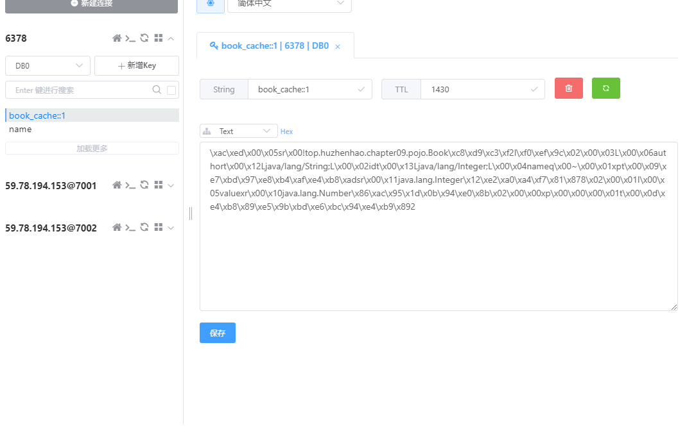
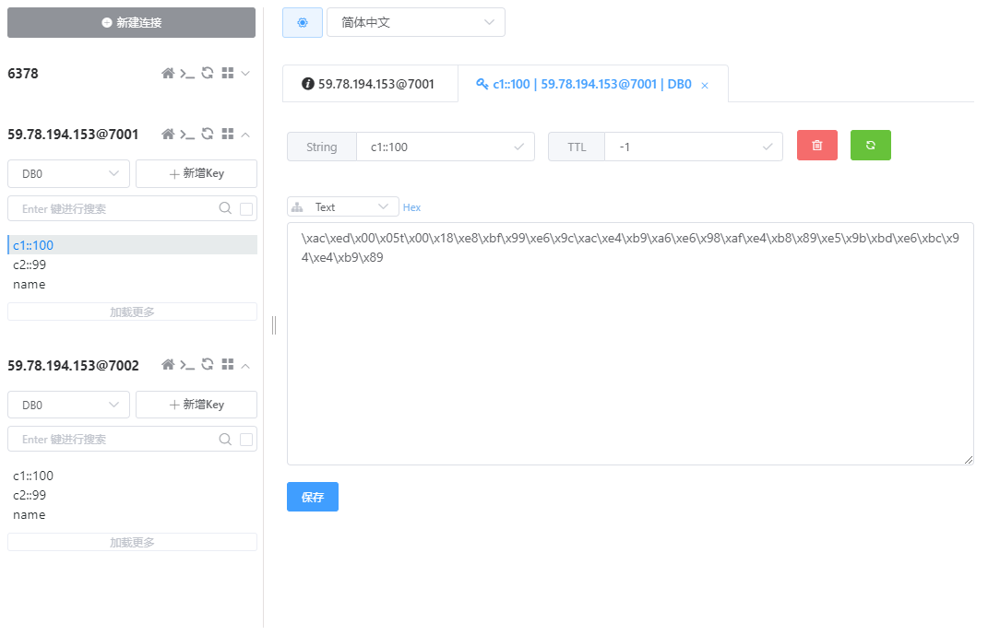

# 第九章 Spring Boot 缓存

## 9.1 Ehcache 2.x 缓存

### 依赖

```xml
<dependencies>
    <dependency>
        <groupId>org.springframework.boot</groupId>
        <artifactId>spring-boot-starter-cache</artifactId>
    </dependency>
    <dependency>
        <groupId>net.sf.ehcache</groupId>
        <artifactId>ehcache</artifactId>
    </dependency>
</dependencies>
```

### 缓存配置文件

src/main/resources/ehcache.xml

```xml
<?xml version="1.0" encoding="UTF-8"?>
<ehcache>
    <!-- 磁盘缓存位置 -->
    <diskStore path="java.io.tmpdir/ehcache"/>

    <!-- 默认缓存 -->
    <defaultCache
            maxEntriesLocalHeap="10000"
            eternal="false"
            timeToIdleSeconds="120"
            timeToLiveSeconds="120"
            maxEntriesLocalDisk="10000000"
            diskExpiryThreadIntervalSeconds="120"
            memoryStoreEvictionPolicy="LRU">
        <persistence strategy="localTempSwap"/>
    </defaultCache>

    <!-- 自定义缓存 -->
    <cache name="book_cache"
           maxElementsInMemory="10000"
           eternal="true"
           timeToIdleSeconds="50"
           timeToLiveSeconds="50"
           overflowToDisk="true"
           diskPersistent="true"
           diskExpiryThreadIntervalSeconds="600"/>
</ehcache>
```

### 代码

实体类和Service

```java
@Repository
@CacheConfig(cacheNames = "book_cache")
public class BookDao {
    @Cacheable
    public Book getBookById(Integer id){
        System.out.println("getBookById");
        Book book = new Book();
        book.setId(id);
        book.setName("三国演义");
        book.setAuthor("罗贯中");
        return book;
    }

    @CachePut(key = "#book.id")
    public Book updateBookById(Book book) {
        System.out.println("updateBookById");
        book.setName("三国演义2");
        return book;
    }

    @CacheEvict(key = "#id")
    public void deleteBookById(Integer id) {
        System.out.println("deleteBookById");
    }
}

// Book.java
public class Book implements Serializable {
    private Integer id;
    private String name;
    private String author;
	// 省略
}

```

### 开启缓存

```java
@SpringBootApplication
@EnableCaching
public class Chapter09Application {
	public static void main(String[] args) {
       SpringApplication.run(Chapter09Application.class, args);
	}
}
```

### 测试

开启`@EnableCaching`前：

```bash
getBookById
getBookById
deleteBookById
getBookById
Book:Book{id=1, name='三国演义', author='罗贯中'}
updateBookById
getBookById
b4:Book{id=1, name='三国演义', author='罗贯中'}
```

开启@EnableCaching后：

```bash
getBookById  --> 第二次get方法走了缓存没有打印
deleteBookById
getBookById  --> 调用删除后，缓存没了，这里执行
Book:Book{id=1, name='三国演义', author='罗贯中'}
updateBookById  --> 更新方法同时更新缓存，接下来get没打印
b4:Book{id=1, name='三国演义2', author='罗贯中'}
```


## 9.2 Redis 单机缓存

### 依赖

```xml
<dependencies>
    <dependency>
        <groupId>org.springframework.boot</groupId>
        <artifactId>spring-boot-starter-cache</artifactId>
    </dependency>
    <dependency>
        <groupId>org.springframework.boot</groupId>
        <artifactId>spring-boot-starter-web</artifactId>
    </dependency>
    <dependency>
        <groupId>org.springframework.boot</groupId>
        <artifactId>spring-boot-starter-data-redis</artifactId>
        <exclusions>
            <exclusion>
                <groupId>io.lettuce</groupId>
                <artifactId>lettuce-core</artifactId>
            </exclusion>
        </exclusions>
    </dependency>
    <dependency>
        <groupId>redis.clients</groupId>
        <artifactId>jedis</artifactId>
    </dependency>
</dependencies>
```

### 缓存配置

```properties
#缓存的配置
## 缓存的前置名
spring.cache.cache-names=c1,c2
## 缓存的时间
spring.cache.redis.time-to-live=1800s

#redis配置
## redis有16库
spring.redis.database=0
## redis的IP
spring.redis.host=59.78.194.153
## redis的端口
spring.redis.port=6378
## redis的密码
spring.redis.password=123456
#redis的连接池最大连接数
spring.redis.jedis.pool.max-active=8
#redis的连接池中最大连接空闲数
spring.redis.jedis.pool.max-idle=8
#redis的连接池中最大等待时间，-1，表示没有限制
spring.redis.jedis.pool.max-wait=-1
#redis的连接池中最小连接空闲数
spring.redis.jedis.pool.min-idle=0
```

### 缓存

其他代码与测试与上一小结一致，测试成功：




## 9.3 Redis集群缓存

### 缓存配置

其余配置同第六章redis集群配置

```java
//@Configuration  书上加了这个注解，实测加了会报错
public class RedisCacheConfig {
    @Autowired
    RedisConnectionFactory conFactory;
    @Bean
    RedisCacheManager redisCacheManager(){
        Map<String, RedisCacheConfiguration> configMap = new HashMap<>();
        RedisCacheConfiguration redisConnection = RedisCacheConfiguration.defaultCacheConfig()
                .prefixKeysWith("ihao:")
                .disableCachingNullValues()
                .entryTtl(Duration.ofMinutes(30));
        configMap.put("c1", redisConnection);
        RedisCacheWriter cacheWriter = RedisCacheWriter.nonLockingRedisCacheWriter(conFactory);
        RedisCacheManager redisCacheManager = new RedisCacheManager(
                cacheWriter,
                RedisCacheConfiguration.defaultCacheConfig(),
                configMap);
        return redisCacheManager;
    }
}
```

### 代码

其余代码与上一下节一致

### 测试

```bash
getBookById
book:这本书是三国演义
book2:这本书是三国演义
deleteBookById
getBookById
getBookById2
```

