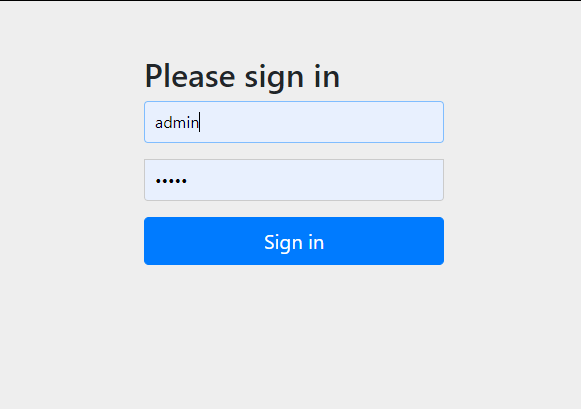
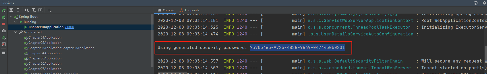
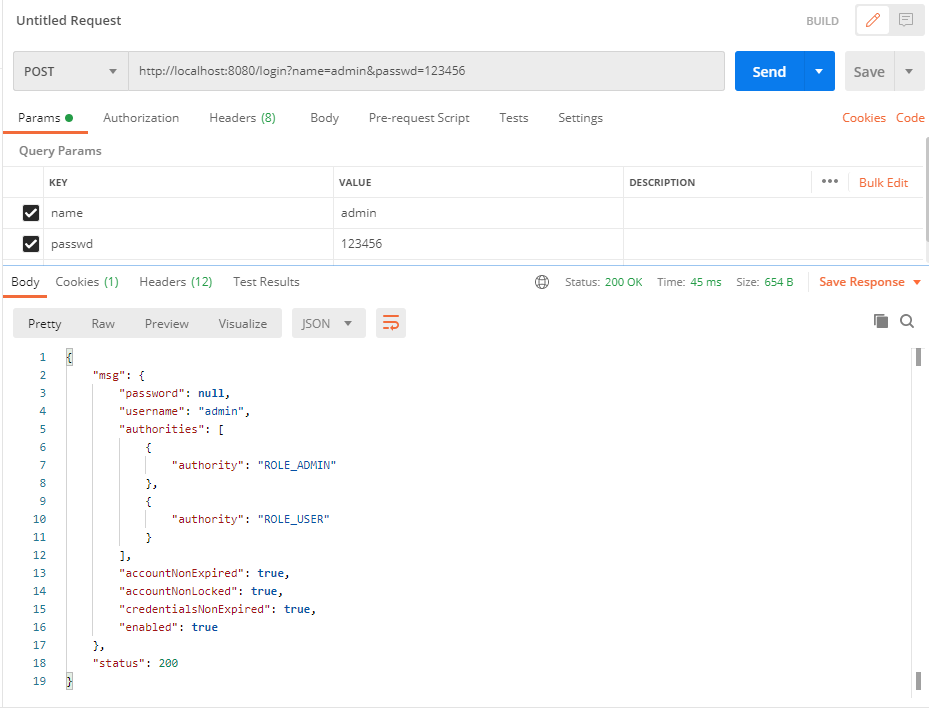
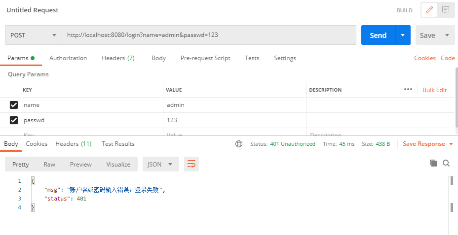

# 第十章 Spring Boot 安全管理

## 10.1 Spring Security 的基本配置

### 10.1.1 基本用法

#### 依赖

```xml
<dependencies>
    <dependency>
        <groupId>org.springframework.boot</groupId>
        <artifactId>spring-boot-starter-security</artifactId>
    </dependency>
</dependencies>
```

#### 接口

```java
@RestController
public class HelloController {
    @GetMapping("hello")
    public String hello() {
        return "Hello";
    }
}
```

#### 测试

访问：http://localhost:8080/hello 自动跳转到登录页面



默认账户：user ， 密码：

登录成功后跳转到访问页。

### 10.1.2 配置用户名和密码

```properties
spring.security.user.name=ihao
spring.security.user.password=123456
spring.security.user.roles=admin
```

### 10.1.3 基于内存的认证

```java
@Configuration
public class MyWebSecurityConfig extends WebSecurityConfigurerAdapter {
    @Bean
    PasswordEncoder passwordEncoder(){
        return NoOpPasswordEncoder.getInstance();
    }
    @Override
    protected void configure(AuthenticationManagerBuilder auth) throws Exception {
        auth.inMemoryAuthentication()
                .withUser("admin").password("123456").roles("ADMIN", "USER")
                .and()
                .withUser("ihao").password("123456").roles("USER");
    }
}
```

### 10.1.4 HttpSecurity

```java
@Configuration
public class MyWebSecurityConfig extends WebSecurityConfigurerAdapter {
    @Bean
    PasswordEncoder passwordEncoder(){
        return NoOpPasswordEncoder.getInstance();
    }
    @Override
    protected void configure(AuthenticationManagerBuilder auth) throws Exception {
        auth.inMemoryAuthentication()
                .withUser("root").password("123456").roles("ADMIN", "DBA")
                .and()
                .withUser("admin").password("123456").roles("ADMIN", "USER")
                .and()
                .withUser("ihao").password("123456").roles("USER");
    }

    @Override
    protected void configure(HttpSecurity http) throws Exception {
        http.authorizeRequests()
                .antMatchers("/admin/**")
                .hasRole("ADMIN")
                .antMatchers("/user/**")
                .access("hasAnyRole('ADMIN', 'USER')")
                .antMatchers("/db/**")
                .access("hasRole('ADMIN') and hasRole('DBA')")
                .anyRequest()
                .authenticated()
                .and()
                .formLogin()
                .loginProcessingUrl("/login")
                .permitAll()
                .and()
                .csrf()
                .disable();
    }
}
```

```java
@RestController
public class HelloController {
    @GetMapping("/db/hello")
    public String dba() {
        return "hello dba!";
    }
    @GetMapping("/admin/hello")
    public String admin() {
        return "hello admin!";
    }
    @GetMapping("/user/hello")
    public String user() {
        return "hello user!";
    }
}
```

以不同的账户登录，会有不同的访问权限

### 10.1.5 登录表单详细配置

#### 代码

```java
@Configuration
public class MyWebSecurityConfig extends WebSecurityConfigurerAdapter {
    @Bean
    PasswordEncoder passwordEncoder(){
        return NoOpPasswordEncoder.getInstance();
    }
    @Override
    protected void configure(AuthenticationManagerBuilder auth) throws Exception {
        auth.inMemoryAuthentication()
                .withUser("root").password("123456").roles("ADMIN", "DBA")
                .and()
                .withUser("admin").password("123456").roles("ADMIN", "USER")
                .and()
                .withUser("ihao").password("123456").roles("USER");
    }
    @Override
    protected void configure(HttpSecurity http) throws Exception {
        http.authorizeRequests()
                .antMatchers("/admin/**")
                .hasRole("ADMIN")
                .antMatchers("/user/**")
                .access("hasAnyRole('ADMIN', 'USER')")
                .antMatchers("/db/**")
                .access("hasRole('ADMIN') and hasRole('DBA')")
                .anyRequest()
                .authenticated()
                .and()
                .formLogin()
                .loginPage("/login_page.html")
                .loginProcessingUrl("/login")
                .usernameParameter("name")
                .passwordParameter("passwd")
                .successHandler(new AuthenticationSuccessHandler() {
                    @Override
                    public void onAuthenticationSuccess(HttpServletRequest httpServletRequest, HttpServletResponse httpServletResponse, Authentication authentication) throws IOException, ServletException {
                        Object principal = authentication.getPrincipal();
                        httpServletResponse.setContentType("application/json;charset=utf-8");
                        PrintWriter out = httpServletResponse.getWriter();
                        httpServletResponse.setStatus(200);
                        Map<String, Object> map = new HashMap<>();
                        map.put("status", 200);
                        map.put("msg", principal);
                        ObjectMapper om = new ObjectMapper();
                        out.write(om.writeValueAsString(map));
                        out.flush();
                        out.close();
                    }
                })
                .failureHandler(new AuthenticationFailureHandler() {
                    @Override
                    public void onAuthenticationFailure(HttpServletRequest httpServletRequest, HttpServletResponse httpServletResponse, AuthenticationException e) throws IOException, ServletException {
                        httpServletResponse.setContentType("application/json;charset=utf-8");
                        PrintWriter out = httpServletResponse.getWriter();
                        httpServletResponse.setStatus(401);
                        Map<String, Object> map = new HashMap<>();
                        map.put("status", 401);
                        if (e instanceof LockedException) {
                            map.put("msg", "账户被锁定，登录失败");
                        } else if (e instanceof BadCredentialsException) {
                            map.put("msg", "账户名或密码输入错误，登录失败");
                        } else if (e instanceof DisabledException) {
                            map.put("msg", "账户被禁用，登录失败");
                        } else if (e instanceof AccountExpiredException) {
                            map.put("msg", "账户已过期，登录失败");
                        } else if (e instanceof CredentialsExpiredException) {
                            map.put("msg", "密码已过期，登录失败");
                        } else {
                            map.put("msg", "登录失败");
                        }
                        ObjectMapper om = new ObjectMapper();
                        out.write(om.writeValueAsString(map));
                        out.flush();
                        out.close();
                    }
                })
                .permitAll()
                .and()
                .csrf()
                .disable();
    }
}
```

#### 测试





### 10.1.7 注销登录配置

```java
.and()
    .logout()
    .logoutUrl("/logout")
    .clearAuthentication(true)
    .invalidateHttpSession(true)
    .addLogoutHandler(new LogoutHandler() {
        @Override
        public void logout(HttpServletRequest httpServletRequest, HttpServletResponse httpServletResponse, Authentication authentication) {

        }
    })
    .logoutSuccessHandler(new LogoutSuccessHandler() {
        @Override
        public void onLogoutSuccess(HttpServletRequest httpServletRequest, HttpServletResponse httpServletResponse, Authentication authentication) throws IOException, ServletException {
            httpServletResponse.sendRedirect("/login_page");
        }
    })
```


### 10.1.8 密码加密

```java
@Bean
PasswordEncoder passwordEncoder(){
    return new BCryptPasswordEncoder(10);
}
```

生成加密后的密码：

```java
@Test
void passwordEncoder() {
    BCryptPasswordEncoder bCryptPasswordEncoder = new BCryptPasswordEncoder(10);
    for (int i = 0; i < 10; i++) {
        String password = "123456";
        String hashed = bCryptPasswordEncoder.encode(password);
        System.out.println(hashed);
    }
}
```

配置到配置代码中：

```java
@Override
protected void configure(AuthenticationManagerBuilder auth) throws Exception {
    auth.inMemoryAuthentication()
        .withUser("root").password("$2a$10$u/l5bdTLrfC1v8wimLFgpuEdmxg.gpePiGkgqo1xgdZYGJ329.bN6").roles("ADMIN", "DBA")
        .and()
        .withUser("admin").password("$2a$10$i/7kJguZi./hcLycAoG56.4YZ3VuU9AYgb8K98QZihKTyi32IfXSi").roles("ADMIN", "USER")
        .and()
        .withUser("ihao").password("$2a$10$GHLUkkMBQNbpexWBNsH9MeCFXQllb5jYSAaRYD/6R9X0v7Z0DqQk.").roles("USER");
}
```

### 10.1.9 方法安全

#### 配置

```java
@Configuration
@EnableGlobalMethodSecurity(prePostEnabled = true, securedEnabled = true)
public class WebSecurityConfig {
}
// MyWebSecurityConfig.configure() 方法注射掉
```

#### 服务

```java
@Service
public class MethodService {
    @Secured("ROLE_DBA")
    public String dba() {
        return "hello dba!";
    }

    @PreAuthorize("hasRole('ADMIN') or hasRole('DBA')")
    public String admin() {
        return "hello admin!";
    }

    @PreAuthorize("hasAnyRole('ADMIN', 'DBA', 'USER')")
    public String user() {
        return "hello user!";
    }
}
```

#### 控制层

```java
@RestController
public class HelloController {
    @Autowired
    MethodService methodService;
    @GetMapping("/db/hello")
    public String dba() {
        return methodService.dba();
    }
    @GetMapping("/admin/hello")
    public String admin() {
        return methodService.admin();
    }
    @GetMapping("/user/hello")
    public String user() {
        return methodService.user();
    }
}
```


#### 测试

访问：http://localhost:8080/admin/hello 需登录相应角色后有访问相应方法的权限