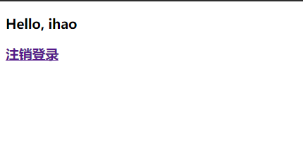

# 第十章 Spring Boot 安全管理

## 10.1 Spring Security 的基本配置

### 10.1.1 基本用法

#### 依赖

```xml
<dependencies>
    <dependency>
        <groupId>org.springframework.boot</groupId>
        <artifactId>spring-boot-starter-security</artifactId>
    </dependency>
</dependencies>
```

#### 接口

```java
@RestController
public class HelloController {
    @GetMapping("hello")
    public String hello() {
        return "Hello";
    }
}
```

#### 测试

访问：http://localhost:8080/hello 自动跳转到登录页面


默认账户：user ， 密码：

登录成功后跳转到访问页。

### 10.1.2 配置用户名和密码

```properties
spring.security.user.name=ihao
spring.security.user.password=123456
spring.security.user.roles=admin
```

### 10.1.3 基于内存的认证

```java
@Configuration
public class MyWebSecurityConfig extends WebSecurityConfigurerAdapter {
    @Bean
    PasswordEncoder passwordEncoder(){
        return NoOpPasswordEncoder.getInstance();
    }
    @Override
    protected void configure(AuthenticationManagerBuilder auth) throws Exception {
        auth.inMemoryAuthentication()
                .withUser("admin").password("123456").roles("ADMIN", "USER")
                .and()
                .withUser("ihao").password("123456").roles("USER");
    }
}
```

### 10.1.4 HttpSecurity

```java
@Configuration
public class MyWebSecurityConfig extends WebSecurityConfigurerAdapter {
    @Bean
    PasswordEncoder passwordEncoder(){
        return NoOpPasswordEncoder.getInstance();
    }
    @Override
    protected void configure(AuthenticationManagerBuilder auth) throws Exception {
        auth.inMemoryAuthentication()
                .withUser("root").password("123456").roles("ADMIN", "DBA")
                .and()
                .withUser("admin").password("123456").roles("ADMIN", "USER")
                .and()
                .withUser("ihao").password("123456").roles("USER");
    }

    @Override
    protected void configure(HttpSecurity http) throws Exception {
        http.authorizeRequests()
                .antMatchers("/admin/**")
                .hasRole("ADMIN")
                .antMatchers("/user/**")
                .access("hasAnyRole('ADMIN', 'USER')")
                .antMatchers("/db/**")
                .access("hasRole('ADMIN') and hasRole('DBA')")
                .anyRequest()
                .authenticated()
                .and()
                .formLogin()
                .loginProcessingUrl("/login")
                .permitAll()
                .and()
                .csrf()
                .disable();
    }
}
```

```java
@RestController
public class HelloController {
    @GetMapping("/db/hello")
    public String dba() {
        return "hello dba!";
    }
    @GetMapping("/admin/hello")
    public String admin() {
        return "hello admin!";
    }
    @GetMapping("/user/hello")
    public String user() {
        return "hello user!";
    }
}
```

以不同的账户登录，会有不同的访问权限

### 10.1.5 登录表单详细配置

#### 代码

```java
@Configuration
public class MyWebSecurityConfig extends WebSecurityConfigurerAdapter {
    @Bean
    PasswordEncoder passwordEncoder(){
        return NoOpPasswordEncoder.getInstance();
    }
    @Override
    protected void configure(AuthenticationManagerBuilder auth) throws Exception {
        auth.inMemoryAuthentication()
                .withUser("root").password("123456").roles("ADMIN", "DBA")
                .and()
                .withUser("admin").password("123456").roles("ADMIN", "USER")
                .and()
                .withUser("ihao").password("123456").roles("USER");
    }
    @Override
    protected void configure(HttpSecurity http) throws Exception {
        http.authorizeRequests()
                .antMatchers("/admin/**")
                .hasRole("ADMIN")
                .antMatchers("/user/**")
                .access("hasAnyRole('ADMIN', 'USER')")
                .antMatchers("/db/**")
                .access("hasRole('ADMIN') and hasRole('DBA')")
                .anyRequest()
                .authenticated()
                .and()
                .formLogin()
                .loginPage("/login_page.html")
                .loginProcessingUrl("/login")
                .usernameParameter("name")
                .passwordParameter("passwd")
                .successHandler(new AuthenticationSuccessHandler() {
                    @Override
                    public void onAuthenticationSuccess(HttpServletRequest httpServletRequest, HttpServletResponse httpServletResponse, Authentication authentication) throws IOException, ServletException {
                        Object principal = authentication.getPrincipal();
                        httpServletResponse.setContentType("application/json;charset=utf-8");
                        PrintWriter out = httpServletResponse.getWriter();
                        httpServletResponse.setStatus(200);
                        Map<String, Object> map = new HashMap<>();
                        map.put("status", 200);
                        map.put("msg", principal);
                        ObjectMapper om = new ObjectMapper();
                        out.write(om.writeValueAsString(map));
                        out.flush();
                        out.close();
                    }
                })
                .failureHandler(new AuthenticationFailureHandler() {
                    @Override
                    public void onAuthenticationFailure(HttpServletRequest httpServletRequest, HttpServletResponse httpServletResponse, AuthenticationException e) throws IOException, ServletException {
                        httpServletResponse.setContentType("application/json;charset=utf-8");
                        PrintWriter out = httpServletResponse.getWriter();
                        httpServletResponse.setStatus(401);
                        Map<String, Object> map = new HashMap<>();
                        map.put("status", 401);
                        if (e instanceof LockedException) {
                            map.put("msg", "账户被锁定，登录失败");
                        } else if (e instanceof BadCredentialsException) {
                            map.put("msg", "账户名或密码输入错误，登录失败");
                        } else if (e instanceof DisabledException) {
                            map.put("msg", "账户被禁用，登录失败");
                        } else if (e instanceof AccountExpiredException) {
                            map.put("msg", "账户已过期，登录失败");
                        } else if (e instanceof CredentialsExpiredException) {
                            map.put("msg", "密码已过期，登录失败");
                        } else {
                            map.put("msg", "登录失败");
                        }
                        ObjectMapper om = new ObjectMapper();
                        out.write(om.writeValueAsString(map));
                        out.flush();
                        out.close();
                    }
                })
                .permitAll()
                .and()
                .csrf()
                .disable();
    }
}
```

#### 测试


### 10.1.7 注销登录配置

```java
.and()
    .logout()
    .logoutUrl("/logout")
    .clearAuthentication(true)
    .invalidateHttpSession(true)
    .addLogoutHandler(new LogoutHandler() {
        @Override
        public void logout(HttpServletRequest httpServletRequest, HttpServletResponse httpServletResponse, Authentication authentication) {

        }
    })
    .logoutSuccessHandler(new LogoutSuccessHandler() {
        @Override
        public void onLogoutSuccess(HttpServletRequest httpServletRequest, HttpServletResponse httpServletResponse, Authentication authentication) throws IOException, ServletException {
            httpServletResponse.sendRedirect("/login_page");
        }
    })
```


### 10.1.8 密码加密

```java
@Bean
PasswordEncoder passwordEncoder(){
    return new BCryptPasswordEncoder(10);
}
```

生成加密后的密码：

```java
@Test
void passwordEncoder() {
    BCryptPasswordEncoder bCryptPasswordEncoder = new BCryptPasswordEncoder(10);
    for (int i = 0; i < 10; i++) {
        String password = "123456";
        String hashed = bCryptPasswordEncoder.encode(password);
        System.out.println(hashed);
    }
}
```

配置到配置代码中：

```java
@Override
protected void configure(AuthenticationManagerBuilder auth) throws Exception {
    auth.inMemoryAuthentication()
        .withUser("root").password("$2a$10$u/l5bdTLrfC1v8wimLFgpuEdmxg.gpePiGkgqo1xgdZYGJ329.bN6").roles("ADMIN", "DBA")
        .and()
        .withUser("admin").password("$2a$10$i/7kJguZi./hcLycAoG56.4YZ3VuU9AYgb8K98QZihKTyi32IfXSi").roles("ADMIN", "USER")
        .and()
        .withUser("ihao").password("$2a$10$GHLUkkMBQNbpexWBNsH9MeCFXQllb5jYSAaRYD/6R9X0v7Z0DqQk.").roles("USER");
}
```

### 10.1.9 方法安全

#### 配置

```java
@Configuration
@EnableGlobalMethodSecurity(prePostEnabled = true, securedEnabled = true)
public class WebSecurityConfig {
}
// MyWebSecurityConfig.configure() 方法注射掉
```

#### 服务

```java
@Service
public class MethodService {
    @Secured("ROLE_DBA")
    public String dba() {
        return "hello dba!";
    }

    @PreAuthorize("hasRole('ADMIN') or hasRole('DBA')")
    public String admin() {
        return "hello admin!";
    }

    @PreAuthorize("hasAnyRole('ADMIN', 'DBA', 'USER')")
    public String user() {
        return "hello user!";
    }
}
```

#### 控制层

```java
@RestController
public class HelloController {
    @Autowired
    MethodService methodService;
    @GetMapping("/db/hello")
    public String dba() {
        return methodService.dba();
    }
    @GetMapping("/admin/hello")
    public String admin() {
        return methodService.admin();
    }
    @GetMapping("/user/hello")
    public String user() {
        return methodService.user();
    }
}
```


#### 测试

访问：http://localhost:8080/admin/hello 需登录相应角色后有访问相应方法的权限


## 10.2 基于数据库的认证

### 设计数据表

```sql
CREATE TABLE `user` (
	`id` INT(11) NOT NULL,
	`username` VARCHAR(32) NOT NULL DEFAULT '',
	`password` VARCHAR(255) NOT NULL DEFAULT '',
	`enabled` TINYINT NOT NULL DEFAULT 0,
	`locked` TINYINT NOT NULL DEFAULT 0,
	PRIMARY KEY (`id`)
)
COMMENT='用户表'
COLLATE='utf8mb4_unicode_ci'
;
CREATE TABLE `user_role` (
	`id` INT(11) NOT NULL,
	`uid` INT(11) NOT NULL,
	`rid` INT(11) NOT NULL,
	PRIMARY KEY (`id`)
)
COLLATE='utf8mb4_unicode_ci'
;
CREATE TABLE `role` (
	`id` INT NOT NULL,
	`name` VARCHAR(32) NOT NULL DEFAULT '',
	`nameZh` VARCHAR(32) NOT NULL DEFAULT '',
	PRIMARY KEY (`id`)
)
COLLATE='utf8mb4_unicode_ci'
;

INSERT INTO `study`.`user` (`id`, `username`, `password`, `enabled`) VALUES ('1', 'root', '$2a$10$XIEXPUVI7KO7BHhcouwOkuGdGMCxrLeP3/4uquolM9.O81hpy7FUK', 'q');
/* SQL错误（1366）：Incorrect integer value: 'q' for column 'enabled' at row 1 */
INSERT INTO `study`.`user` (`id`, `username`, `password`, `enabled`) VALUES ('1', 'root', '$2a$10$XIEXPUVI7KO7BHhcouwOkuGdGMCxrLeP3/4uquolM9.O81hpy7FUK', '1');
SELECT `id`, `username`, `password`, `enabled`, `locked` FROM `study`.`user` WHERE  `id`=1;
INSERT INTO `study`.`user` (`id`, `username`, `password`, `enabled`) VALUES ('2', 'admin', '$2a$10$G/nzb3czQABEZy4HgEN7pu8KCRNgM076KGpsB7mU6nvdLnyEcPO.S', '1');
SELECT `id`, `username`, `password`, `enabled`, `locked` FROM `study`.`user` WHERE  `id`=2;
INSERT INTO `study`.`user` (`id`, `username`, `password`, `enabled`) VALUES ('3', 'ihao', '$2a$10$dRtaxlvje3y9rM40uHpFzeTVD/Ivaae6BMgTTxuYoiD35m16BSpx2', '1');
SELECT `id`, `username`, `password`, `enabled`, `locked` FROM `study`.`user` WHERE  `id`=3;

INSERT INTO `study`.`role` (`id`, `name`, `nameZh`) VALUES ('1', 'ROLE_dba', '数据库管理员');
SELECT `id`, `name`, `nameZh` FROM `study`.`role` WHERE  `id`=1;
INSERT INTO `study`.`role` (`id`, `name`, `nameZh`) VALUES ('2', 'ROLE_admin', '系统管理员');
SELECT `id`, `name`, `nameZh` FROM `study`.`role` WHERE  `id`=2;
INSERT INTO `study`.`role` (`id`, `name`, `nameZh`) VALUES ('3', 'ROLE_user', '用户');
SELECT `id`, `name`, `nameZh` FROM `study`.`role` WHERE  `id`=3;

INSERT INTO `study`.`user_role` (`id`, `uid`, `rid`) VALUES ('1', '1', '1');
SELECT `id`, `uid`, `rid` FROM `study`.`user_role` WHERE  `id`=1;
INSERT INTO `study`.`user_role` (`id`, `uid`, `rid`) VALUES ('2', '1', '2');
SELECT `id`, `uid`, `rid` FROM `study`.`user_role` WHERE  `id`=2;
INSERT INTO `study`.`user_role` (`id`, `uid`, `rid`) VALUES ('3', '2', '2');
SELECT `id`, `uid`, `rid` FROM `study`.`user_role` WHERE  `id`=3;
INSERT INTO `study`.`user_role` (`id`, `uid`, `rid`) VALUES ('4', '3', '3');
SELECT `id`, `uid`, `rid` FROM `study`.`user_role` WHERE  `id`=4;
```

### 创建项目

```xml
<dependencies>
    <dependency>
        <groupId>org.springframework.boot</groupId>
        <artifactId>spring-boot-starter-security</artifactId>
    </dependency>
    <dependency>
        <groupId>org.mybatis.spring.boot</groupId>
        <artifactId>mybatis-spring-boot-starter</artifactId>
        <version>1.3.2</version>
    </dependency>
    <dependency>
        <groupId>mysql</groupId>
        <artifactId>mysql-connector-java</artifactId>
        <scope>runtime</scope>
    </dependency>
    <dependency>
        <groupId>com.alibaba</groupId>
        <artifactId>druid</artifactId>
        <version>1.1.10</version>
    </dependency>
</dependencies>
```

### 配置数据库

```properties
spring.datasource.type=com.alibaba.druid.pool.DruidDataSource
spring.datasource.url=jdbc:mysql://59.78.194.153:3306/study?useUnicode=true&characterEncoding=utf8&useSSL=false&serverTimezone=Hongkong
spring.datasource.username=root
spring.datasource.password=123456
```

### 实体类

```java
public class Role {
    private Integer id;
    private String name;
    private String nameZh;
	// getter setter 
}
```

```java
public class User implements UserDetails {
    private Integer id;
    private String username;
    private String password;
    private Boolean enabled;
    private Boolean locked;
    private List<Role> roles;

    @Override
    public Collection<? extends GrantedAuthority> getAuthorities() {
        List<SimpleGrantedAuthority> authorities = new ArrayList<>();
        for (Role role : roles) {
            authorities.add(new SimpleGrantedAuthority(role.getName()));
        }
        return authorities;
    }

    @Override
    public String getPassword() {
        return password;
    }

    @Override
    public String getUsername() {
        return username;
    }

    @Override
    public boolean isAccountNonExpired() {
        return true;
    }

    @Override
    public boolean isAccountNonLocked() {
        return !locked;
    }

    @Override
    public boolean isCredentialsNonExpired() {
        return true;
    }

    @Override
    public boolean isEnabled() {
        return enabled;
    }

    public Integer getId() {
        return id;
    }

    public void setId(Integer id) {
        this.id = id;
    }

    public List<Role> getRoles() {
        return roles;
    }

    public void setRoles(List<Role> roles) {
        this.roles = roles;
    }
    // toString() {

}
```

### 创建Service

```java
@Service
public class UserService implements UserDetailsService {
    @Autowired
    UserMapper userMapper;

    @Override
    public UserDetails loadUserByUsername(String username) throws UsernameNotFoundException {
        User user = userMapper.loadUserByUsername(username);
        System.out.println("user:" + user);
        if (user == null) {
            throw new UsernameNotFoundException("账户不存在");
        }
        user.setRoles(userMapper.getUserRolesByUid(user.getId()));
        return user;
    }
}
```

### Dao层

```java
@Mapper
public interface UserMapper {
    User loadUserByUsername(String username);

    List<Role> getUserRolesByUid(Integer id);
}
```

```xml
<?xml version="1.0" encoding="UTF-8"?>
<!DOCTYPE mapper PUBLIC "-//mybatis.org//DTD Mapper 3.0//EN" "http://mybatis.org/dtd/mybatis-3-mapper.dtd">
<mapper namespace="top.huzhenhao.chapter10.dao.UserMapper">
    <select id="loadUserByUsername" resultType="top.huzhenhao.chapter10.pojo.User">
        select * from user where username=#{username}
    </select>
    <select id="getUserRolesByUid" resultType="top.huzhenhao.chapter10.pojo.Role">
        select * from role r, user_role ur where r.id=ur.id and ur.id=#{id}
    </select>
</mapper>
```

### 配置 Spring Security

```java
@Configuration
public class MyWebSecurityConfig extends WebSecurityConfigurerAdapter {
    @Autowired
    UserService userService;

    @Bean
    PasswordEncoder passwordEncoder() {
        return new BCryptPasswordEncoder(10);
    }

    @Override
    protected void configure(AuthenticationManagerBuilder auth) throws Exception {
        auth.userDetailsService(userService);
    }
}
```

### 测试

controller 层同前


## 10.4 OAuth

### 依赖

```xml
<dependencies>
    <dependency>
        <groupId>org.springframework.boot</groupId>
        <artifactId>spring-boot-starter-security</artifactId>
    </dependency>
    <dependency>
        <groupId>org.springframework.boot</groupId>
        <artifactId>spring-boot-starter-data-redis</artifactId>
        <exclusions>
            <exclusion>
                <groupId>io.lettuce</groupId>
                <artifactId>lettuce-core</artifactId>
            </exclusion>
        </exclusions>
    </dependency>
    <dependency>
        <groupId>redis.clients</groupId>
        <artifactId>jedis</artifactId>
    </dependency>
    <dependency>
        <groupId>org.springframework.security.oauth</groupId>
        <artifactId>spring-security-oauth2</artifactId>
        <version>2.3.4.RELEASE</version>
    </dependency>
</dependencies>
```


### 配置 Redis

```properties
# REDIS (RedisProperties)
# Redis数据库索引（默认为0）
spring.redis.database=0
# Redis服务器地址
spring.redis.host=59.78.194.153
# Redis服务器连接端口
spring.redis.port=6378
# Redis服务器连接密码（默认为空）
spring.redis.password=1xx
# 连接池最大连接数（使用负值表示没有限制）
spring.redis.pool.max-active=8
# 连接池最大阻塞等待时间（使用负值表示没有限制）
spring.redis.pool.max-wait=-1
# 连接池中的最大空闲连接
spring.redis.pool.max-idle=8
# 连接池中的最小空闲连接
spring.redis.pool.min-idle=0
# 连接超时时间（毫秒）
spring.redis.timeout=0
```

### 配置授权服务器

```java
@Configuration
@EnableAuthorizationServer
public class AuthorizationServerConfig extends AuthorizationServerConfigurerAdapter {
    @Autowired
    AuthenticationManager authenticationManager;
    @Autowired
    RedisConnectionFactory redisConnectionFactory;
    @Autowired
    UserDetailsService userDetailsService;
    @Bean
    PasswordEncoder passwordEncoder() {
        return new BCryptPasswordEncoder();
    }

    @Override
    public void configure(ClientDetailsServiceConfigurer clients) throws Exception {
        clients.inMemory()
                .withClient("password")
                .authorizedGrantTypes("password", "refresh_token")
                .accessTokenValiditySeconds(1800)
                .resourceIds("rid")
                .scopes("all")
                .secret("$2a$10$dRtaxlvje3y9rM40uHpFzeTVD/Ivaae6BMgTTxuYoiD35m16BSpx2");
    }

    @Override
    public void configure(AuthorizationServerEndpointsConfigurer endpoints) throws Exception {
        endpoints.tokenStore(new RedisTokenStore(redisConnectionFactory))
                .authenticationManager(authenticationManager)
                .userDetailsService(userDetailsService);
    }

    @Override
    public void configure(AuthorizationServerSecurityConfigurer security) throws Exception {
        security.allowFormAuthenticationForClients();
    }
}
```


### 配置资源服务器

```java
@Configuration
@EnableResourceServer
public class ResourceServerConfig extends ResourceServerConfigurerAdapter {
    @Override
    public void configure(ResourceServerSecurityConfigurer resources) throws Exception {
        resources.resourceId("rid").stateless(true);
    }

    @Override
    public void configure(HttpSecurity http) throws Exception {
        http.authorizeRequests()
                .antMatchers("/admin/**").hasRole("admin")
                .antMatchers("/user/**").hasRole("user")
                .anyRequest().authenticated();
    }
}
```

·

### 配置 Security

```java
@Configuration
public class WebSecurityConfig extends WebSecurityConfigurerAdapter {
    @Bean(name = BeanIds.AUTHENTICATION_MANAGER)
    @Override
    public AuthenticationManager authenticationManagerBean() throws Exception {
        return super.authenticationManagerBean();
    }

    @Bean
    @Override
    protected UserDetailsService userDetailsService() {
        return super.userDetailsService();
    }

    @Override
    protected void configure(AuthenticationManagerBuilder auth) throws Exception {
        auth.inMemoryAuthentication()
                .withUser("admin")
                .password("$2a$10$dRtaxlvje3y9rM40uHpFzeTVD/Ivaae6BMgTTxuYoiD35m16BSpx2")
                .roles("admin")
                .and()
                .withUser("ihao")
                .password("$2a$10$dRtaxlvje3y9rM40uHpFzeTVD/Ivaae6BMgTTxuYoiD35m16BSpx2")
                .roles("user");
    }

    @Override
    protected void configure(HttpSecurity http) throws Exception {
        http.antMatcher("/oauth/**").authorizeRequests()
                .antMatchers("/oauth/**").permitAll()
                .and().csrf().disable();
    }
}
```


### 测试验证

post: http://localhost:8080/oauth/token?username=ihao&password=123456&grant_type=password&client_id=password&scope=all&client_secret=123456

```
{
    "access_token": "518b32ac-6e46-4387-a3c5-467a47e28745",
    "token_type": "bearer",
    "refresh_token": "cefc0a87-7349-48cb-ace5-a7a7ab19581e",
    "expires_in": 1799,
    "scope": "all"
}
```

post: http://localhost:8080/oauth/token?username=ihao&password=123456&grant_type=refresh_token&refresh_token=cefc0a87-7349-48cb-ace5-a7a7ab19581e&client_id=password&scope=all&client_secret=123456

```
{
    "access_token": "bd00cf8b-0ad9-445e-92f5-1176b5fd8636",
    "token_type": "bearer",
    "refresh_token": "cefc0a87-7349-48cb-ace5-a7a7ab19581e",
    "expires_in": 1799,
    "scope": "all"
}
```

get: http://localhost:8080/user/hello?access_token=bd00cf8b-0ad9-445e-92f5-1176b5fd8636

```
Hello user
```

get: http://localhost:8080/admin/hello?access_token=bd00cf8b-0ad9-445e-92f5-1176b5fd8636

```
{
    "error": "access_denied",
    "error_description": "Access is denied"
}
```

reids：


## 10.5 整合 Shiro

### 依赖

```xml
<dependencies>
    <dependency>
        <groupId>org.apache.shiro</groupId>
        <artifactId>shiro-spring-boot-web-starter</artifactId>
        <version>1.4.0</version>
    </dependency>
    <dependency>
        <groupId>org.springframework.boot</groupId>
        <artifactId>spring-boot-starter-thymeleaf</artifactId>
    </dependency>
    <dependency>
        <groupId>com.github.theborakompanioni</groupId>
        <artifactId>thymeleaf-extras-shiro</artifactId>
        <version>2.0.0</version>
    </dependency>
</dependencies>
```

### 配置

配置文件

```properties
shiro.enabled=true
shiro.web.enabled=true
shiro.loginUrl=/login
shiro.successUrl=/index
shiro.unauthorizedUrl=/unauthorized
shiro.sessionManager.sessionIdUrlRewritingEnabled=true
shiro.sessionManager.sessionIdCookieEnabled=true
```

配置Shiro

```java
@Configuration
public class ShiroConfig {
    @Bean
    public Realm realm() {
        TextConfigurationRealm realm = new TextConfigurationRealm();
        realm.setUserDefinitions("ihao=123456,user\n admin=123456,admin"); //添加用户名+密码+角色
        realm.setRoleDefinitions("admin=read,write\n user=read"); //添加权限
        return realm;
    }

    @Bean
    public ShiroFilterChainDefinition shiroFilterChainDefinition() {
        DefaultShiroFilterChainDefinition chainDefinition = new DefaultShiroFilterChainDefinition();
        chainDefinition.addPathDefinition("/login", "anon");
        chainDefinition.addPathDefinition("/doLogin", "anon");
        chainDefinition.addPathDefinition("/logout", "logout");
        chainDefinition.addPathDefinition("/**", "authc");
        return chainDefinition;
    }

    @Bean
    public ShiroDialect shiroDialect() {
        return new ShiroDialect();
    }
}
```

不需要角色访问页面配置

```java
@Configuration
public class WebMvcConfig implements WebMvcConfigurer {
    @Override
    public void addViewControllers(ViewControllerRegistry registry) {
        registry.addViewController("/login").setViewName("login");
        registry.addViewController("/index").setViewName("index");
        registry.addViewController("/unauthorized").setViewName("unauthorized");
    }
}
```

配置全局异常处理

```java
@ControllerAdvice
public class ExceptionController {
    @ExceptionHandler(AuthorizationException.class)
    public ModelAndView error(AuthorizationException e) {
        ModelAndView mv = new ModelAndView("unauthorized");
        mv.addObject("error", e.getMessage());
        return mv;
    }
}
```


### 控制层

```java
@Controller
public class UserController {
    @PostMapping("/doLogin")
    public String doLogin(String username, String passwd, Model model) {
        // 记一个小坑：
        // username 和 passwd 两个参数接受的是来自login.html 中的 input 标签内的数据，名字需要对应
        // 之前就是因为这里的参数名为 passwd login里提交的是password 害的密码一直验证出错
        System.out.println("username:" + username);
        System.out.println("passwd:" + passwd); 
        UsernamePasswordToken token = new UsernamePasswordToken(username, passwd);
        Subject subject = SecurityUtils.getSubject();
        try {
            subject.login(token);
        } catch (AuthenticationException e) {
            model.addAttribute("error", "用户名或密码错误");
            return "login";
        }
        return "redirect:/index";
    }

    @RequiresRoles("admin")
    @GetMapping("/admin")
    public String admin() {
        return "admin";
    }

    @RequiresRoles(value = {"admin", "user"}, logical = Logical.OR)
    @GetMapping("/user")
    public String user() {
        return "user";
    }
}
```


### 添加五个HTML页面


index.html

```html
<!DOCTYPE html>
<html lang="en" xmlns:shiro="http://www.pollix.at/thymeleaf/shiro">
<head>
    <meta charset="UTF-8">
    <title>Title</title>
</head>
<body>
<h3>Hello, <shiro:principal/></h3>
<h3><a href="/logout">注销登录</a> </h3>
<h3><a shiro:hasRole="admin" href="/admin">管理员页面</a> </h3>
<h3><a shiro:hasAllRoles="admin,user" href="/user">普通用户页面</a> </h3>
</body>
</html>
```

login.html

```html
<!DOCTYPE html>
<html lang="en" xmlns:th="http://www.thymeleaf.org">
<head>
    <meta charset="UTF-8">
    <title>Title</title>
</head>
<body>
    <div>
        <form action="/doLogin" method="post">
            <input type="text" name="username"><br>
            <input type="password" name="passwd"><br>
            <div th:text="${error}"></div>
            <input type="submit" value="登录">
        </form>
    </div>
</body>
</html>
```

user.html

```html
<!DOCTYPE html>
<html lang="en">
<head>
    <meta charset="UTF-8">
    <title>Title</title>
</head>
<body>
<h1>普通用户界面</h1>
</body>
</html>
```

admin.html

```html
<!DOCTYPE html>
<html lang="en">
<head>
    <meta charset="UTF-8">
    <title>Title</title>
</head>
<body>
<h1>管理员界面</h1>
</body>
</html>
```

unauthorized.html

```html
<!DOCTYPE html>
<html lang="en" xmlns:th="http://www.thymeleaf.org">
<head>
    <meta charset="UTF-8">
    <title>Title</title>
</head>
<body>
<div>
    <h3>未获授权，非法访问</h3>
    <h3 th:text="${error}"></h3>
</div>
</body>
</html>
```

### 测试




