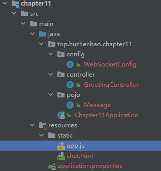
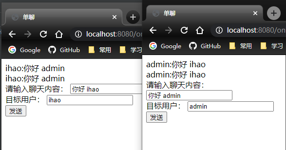

# 第十一章 Spring Boot 整合 WebScoket

## 11.1 消息群发

### 依赖

```xml
<dependencies>
    <dependency>
        <groupId>org.springframework.boot</groupId>
        <artifactId>spring-boot-starter-websocket</artifactId>
    </dependency>
    <dependency>
        <groupId>org.webjars</groupId>
        <artifactId>webjars-locator-core</artifactId>
    </dependency>
    <dependency>
        <groupId>org.webjars</groupId>
        <artifactId>sockjs-client</artifactId>
        <version>1.1.2</version>
    </dependency>
    <dependency>
        <groupId>org.webjars</groupId>
        <artifactId>stomp-websocket</artifactId>
        <version>2.3.3</version>
    </dependency>
    <dependency>
        <groupId>org.webjars</groupId>
        <artifactId>jquery</artifactId>
        <version>3.3.1</version>
    </dependency>
</dependencies>
```

### 配置

WebSocket

```java
@Configuration
@EnableWebSocketMessageBroker
public class WebSocketConfig implements WebSocketMessageBrokerConfigurer {
    @Override
    public void configureMessageBroker(MessageBrokerRegistry config) {
        config.enableSimpleBroker("/topic");
        config.setApplicationDestinationPrefixes("/app");
    }

    @Override
    public void registerStompEndpoints(StompEndpointRegistry registry) {
        registry.addEndpoint("/chat").withSockJS();
    }
}
```

### 实体类

```java
public class Message {
    private String name;
    private String content;
}
```

### 控制层

```java
@Controller
public class GreetingController {
    @MessageMapping("/hello")
    @SendTo("/topic/greetings")
    public Message greeting(Message message) throws Exception {
        return message;
    }
}
```

### 聊天页面

```html
<!DOCTYPE html>
<html lang="en">
<head>
    <meta charset="UTF-8">
    <title>群聊</title>
    <script src="/webjars/jquery/jquery.min.js"></script>
    <script src="/webjars/sockjs-client/sockjs.min.js"></script>
    <script src="/webjars/stomp-websocket/stomp.min.js"></script>
    <script src="app.js"></script>
</head>
<body>
<div>
    <lable for="name">请输入用户名：</lable>
    <input type="text" id="name" placeholder="用户名">
</div>
<div>
    <button id="connect" type="button">连接</button>
    <button id="disconnect" type="button" disabled="disabled">断开连接</button>
</div>
<div id="chat" style="display: none">
    <div>
        <label for="name">请输入聊天内容</label>
        <input type="text" id="content" placeholder="聊天内容">
    </div>
    <button id="send" type="button">发送</button>
    <div id="greetings">
        <div id="conversation" style="display: none">群聊进行中...</div>
    </div>
</div>
</body>
</html>
```

自定义JS

```js
var stompClient = null;

function setConnected(connected) {
    $("#connect").prop("disabled", connected);
    $("#disconnect").prop("disabled", !connected);
    if (connected) {
        $("#conversation").show();
        $("#chat").show();
    } else {
        $("#conversation").hide();
        $("#chat").hide();
    }
    // $("#greetings").html("");
}

function connect() {
    if (!$("#name").val()) {
        return;
    }
    var socket = new SockJS("/chat");
    stompClient = Stomp.over(socket);
    stompClient.connect({}, function (frame) {
        setConnected(true);
        stompClient.subscribe("/topic/greetings", function (greeting) {
            showGreeting(JSON.parse(greeting.body));
        });
    });
}

function disconnect() {
    if (stompClient !== null) {
        stompClient.disconnect();
    }
    setConnected(false);
}

function sendName() {
    console.log("sendName()...")
    stompClient.send("/app/hello", {},
        JSON.stringify({'name': $("#name").val(), 'content': $("#content").val()}));
}

function showGreeting(message) {
    $("#greetings")
        .append("<div>" + message.name + ":" + message.content + "</div>");
}

$(function () {
    $("#connect").click(function () { connect(); });
    $("#disconnect").click(function () { disconnect(); });
    $("#send").click(function () { sendName(); });
});
```



### 测试


## 11.2 消息点对点发送

上一届基础上改进

### 依赖

```xml
<dependencies>
    <dependency>
        <groupId>org.springframework.boot</groupId>
        <artifactId>spring-boot-starter-websocket</artifactId>
    </dependency>
    <dependency>
        <groupId>org.webjars</groupId>
        <artifactId>webjars-locator-core</artifactId>
    </dependency>
    <dependency>
        <groupId>org.webjars</groupId>
        <artifactId>sockjs-client</artifactId>
        <version>1.1.2</version>
    </dependency>
    <dependency>
        <groupId>org.webjars</groupId>
        <artifactId>stomp-websocket</artifactId>
        <version>2.3.3</version>
    </dependency>
    <dependency>
        <groupId>org.webjars</groupId>
        <artifactId>jquery</artifactId>
        <version>3.3.1</version>
    </dependency>
    <dependency>
        <groupId>org.springframework.boot</groupId>
        <artifactId>spring-boot-starter-security</artifactId>
    </dependency>
</dependencies>
```

### 配置 Spring Security

同第十章的内容

```java
@Configuration
public class MyWebSecurityConfig extends WebSecurityConfigurerAdapter {
    @Bean
    PasswordEncoder passwordEncoder(){
        return NoOpPasswordEncoder.getInstance();
    }
    @Override
    protected void configure(AuthenticationManagerBuilder auth) throws Exception {
        auth.inMemoryAuthentication()
                .withUser("admin").password("123456").roles("ADMIN", "USER")
                .and()
                .withUser("ihao").password("123456").roles("USER");
    }

    @Override
    protected void configure(HttpSecurity http) throws Exception {
        http.authorizeRequests()
                .anyRequest()
                .authenticated()
                .and()
                .formLogin()
                .permitAll();
    }
}
```


配置 WebSocket

```java
@Configuration
@EnableWebSocketMessageBroker
public class WebSocketConfig implements WebSocketMessageBrokerConfigurer {
    @Override
    public void configureMessageBroker(MessageBrokerRegistry config) {
        config.enableSimpleBroker("/topic", "/queue");
        config.setApplicationDestinationPrefixes("/app");
    }

    @Override
    public void registerStompEndpoints(StompEndpointRegistry registry) {
        registry.addEndpoint("/chat").withSockJS();
    }
}
```

### 实体类

```java
public class Chat {
    private String to;
    private String from;
    private String content;
}
```

### 控制层

```java
@Controller
public class GreetingController {
    @Autowired
    SimpMessagingTemplate messagingTemplate;

    @MessageMapping("/hello")
    @SendTo("/topic/greetings")
    public Message greeting(Message message) throws Exception {
        return message;
    }

    @MessageMapping("/chat")
    public void chat(Principal principal, Chat chat) {
        String from = principal.getName();
        chat.setFrom(from);
        messagingTemplate.convertAndSendToUser(chat.getTo(), "/queue/chat", chat);
    }
}
```

### 页面

```html
<!DOCTYPE html>
<html lang="en">
<head>
    <meta charset="UTF-8">
    <title>单聊</title>
    <script src="/webjars/jquery/jquery.min.js"></script>
    <script src="/webjars/sockjs-client/sockjs.min.js"></script>
    <script src="/webjars/stomp-websocket/stomp.min.js"></script>
    <script src="chat.js"></script>
</head>
<body>
<div id="chat">
    <div id="chatsContent"></div>

    <div>
        请输入聊天内容：
        <input type="text" id="content" placeholder="聊天内容">
        <br>
        目标用户：
        <input type="text" id="to" placeholder="目标用户">
        <br>
        <button id="send" type="button">发送</button>
    </div>

</div>
</body>
</html>
```

```js
var stompClient = null;

function connect() {
    var socket = new SockJS("/chat");
    stompClient = Stomp.over(socket);
    stompClient.connect({}, function (frame) {
        stompClient.subscribe("/user/queue/chat", function (chat) {
            showGreeting(JSON.parse(chat.body));
        });
    });
}

function sendMsg() {
    stompClient.send("/app/chat", {},
        JSON.stringify({'content': $("#content").val(), 'to': $("#to").val()}));
}

function showGreeting(message) {
    $("#chatsContent").append("<div>" + message.from + ":" + message.content + "</div>");
}

$(function () {
    connect();
    $("#send").click(function () { sendMsg(); });
});
```

### 测试

登录配置的两个账户

