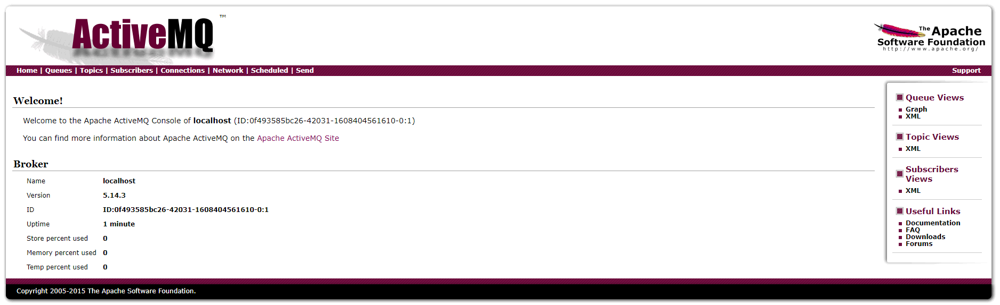
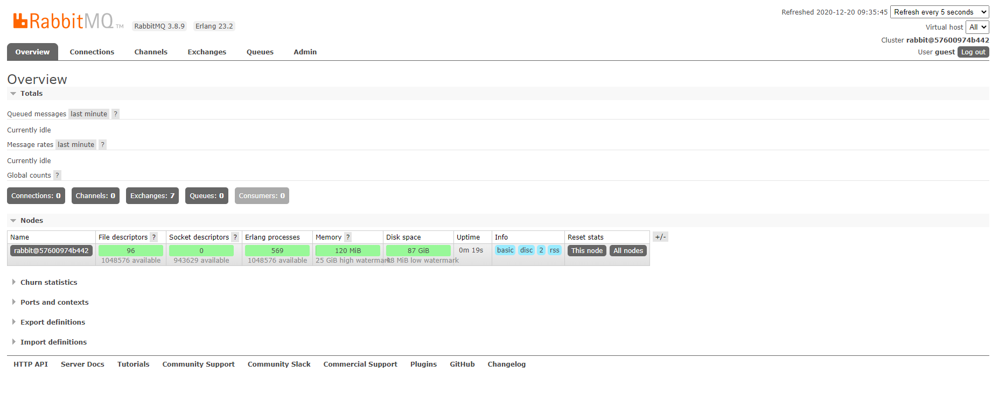
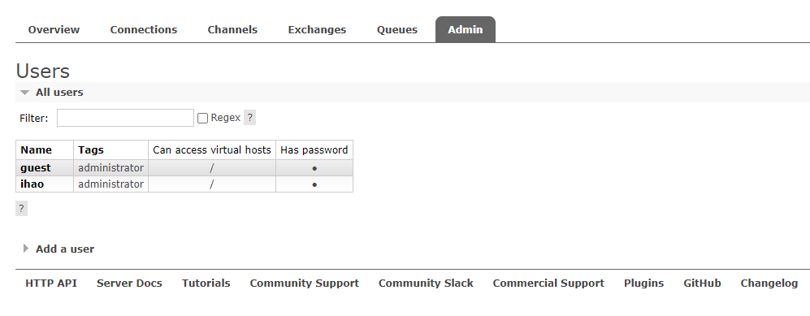

# 第十二章 消息服务

## 12.1 JMS-ActiveMQ

### docker下安装ActiveMQ

> https://developer.aliyun.com/article/572390

- 查询Docker镜像

```
docker search activemq
```

- 下载Docker镜像

```
docker pull webcenter/activemq
```

- 创建&运行ActiveMQ容器

```
docker run -d --name myactivemq -p 61616:61616 -p 8161:8161 webcenter/activemq
```

- 查看WEB管理页面：
  浏览器输入`http://127.0.0.1:8161/`，点击`Manage ActiveMQ broker`使用默认账号/密码：`admin`/`admin`进入查看




### 依赖

```xml
<dependencies>
    <dependency>
        <groupId>org.springframework.boot</groupId>
        <artifactId>spring-boot-starter-activemq</artifactId>
    </dependency>
</dependencies>
```

### 配置

```properties
spring.activemq.broker-url=tcp://59.78.194.153:61616
spring.activemq.packages.trust-all=true
spring.activemq.user=admin
spring.activemq.password=admin
```

### 项目配置类

提供一个消息队列Bean

```java
import javax.jms.Queue;
@SpringBootApplication
public class Chapter12Application {
	public static void main(String[] args) {
		SpringApplication.run(Chapter12Application.class, args);
	}
	@Bean
	Queue queue() {
		return new ActiveMQQueue("amq");
	}
}
```

### JMS 组件

```java
@Component
public class JmsComponent {
    @Autowired
    JmsMessagingTemplate messagingTemplate;
    @Autowired
    Queue queue;

    public void send(Message msg) {
        messagingTemplate.convertAndSend(this.queue, msg);
    }

    @JmsListener(destination = "amq")
    public void receive(Message msg) {
        System.out.println("receive:" + msg);
    }
}
```

### 实体类

```java
public class Message implements Serializable {
    private String content;
    private Date date;
}
```


### 测试

```java
@SpringBootTest
class Chapter12ApplicationTests {
	@Autowired
	JmsComponent jmsComponent;
	@Test
	void contextLoads() {
		Message msg = new Message();
		msg.setContent("hello jsm!");
		msg.setDate(new Date());
		jmsComponent.send(msg);
	}
}
```

运行后输出：

```bash
receive:Message{content='hello jsm!', date=Sat Dec 19 20:11:02 CST 2020}
```


## 12.2 AMQP-RabbitMQ

### docker安装 RabbitMQ

> https://www.jianshu.com/p/14ffe0f3db94

这里注意获取镜像的时候要获取management版本的，不要获取last版本的，management版本的才带有管理界面。

#### 获查询镜像

```bash
 docker search rabbitmq:management
```


#### 获取镜像

```bash
docker pull rabbitmq:management
```

可以看到如下结果

```bash
[hzh@localhost ~]$ docker pull rabbitmq:management
management: Pulling from library/rabbitmq
f22ccc0b8772: Pull complete
3cf8fb62ba5f: Pull complete
e80c964ece6a: Pull complete
c1d2d6c5864b: Pull complete
a1d14468c24f: Pull complete
ac5224ea1eb3: Pull complete
8da622546a6c: Pull complete
5f20211ad28c: Pull complete
553fbbbec0d8: Pull complete
87e159513515: Pull complete
e7ad102c950f: Pull complete
fc664c88ed06: Pull complete
4c05edd7de3b: Pull complete
Digest: sha256:83fb3d109a3775bd8bc38629864bf54c074c41c5e34b608987b0b524ba707aff
Status: Downloaded newer image for rabbitmq:management
docker.io/library/rabbitmq:management
```


#### 运行镜像

```bash
[hzh@localhost ~]$ docker run -d -p 5672:5672 -p 15672:15672 --name rabbitmq rabbitmq:management
57600974b4423618a9339d75212bba4770231e4b9605c81c8f73d53a7d4567f8
```


#### 访问管理界面

访问管理界面的地址就是 http://59.78.194.153:15672，可以使用默认的账户登录，用户名和密码都guest，如：



#### 新建用户

默认 guest 用户，新建一个自己的可远程登录的用户



### Spring Boot 整合 RabbitMQ

#### 依赖

``` xml
<dependency>
    <groupId>org.springframework.boot</groupId>
    <artifactId>spring-boot-starter-amqp</artifactId>
</dependency>
```


#### 配置

```properties
spring.rabbitmq.host=59.78.194.153
spring.rabbitmq.port=5672
spring.rabbitmq.username=ihao
spring.rabbitmq.password=123456
```

### Direct 策略

#### 策略配置

```java
@Configuration
public class RabbitDirectConfig {
    public final static String DIRECTNAME = "ihao-direct";
    @Bean
    Queue queue() {
        return new Queue("hello-queue");
    }
    @Bean
    DirectExchange directExchange() {
        return new DirectExchange(DIRECTNAME, true, false);
    }
    @Bean
    Binding binding() {
        return BindingBuilder.bind(queue())
                .to(directExchange()).with("direct");
    }
}
```

#### 配置消费者

```java
@Component
public class DirectReceiver {
    @RabbitListener(queues = "hello-queue")
    public void handler1(String msg) {
        System.out.println("DirectReceiver:" + msg);
    }
}
```

#### 测试

```java
@SpringBootTest
class Chapter12ApplicationTests {
	@Autowired
	JmsComponent jmsComponent;
	@Test
	void contextLoads() {
		Message msg = new Message();
		msg.setContent("hello jsm!");
		msg.setDate(new Date());
		jmsComponent.send(msg);
	}
}
// 输出
// DirectReceiver:hello direct
```

### Fanout 策略

#### 策略配置

```java
@Configuration
public class RabbitFanoutConfig {
    public final static String FANOUTNAME = "ihao-fanout";
    @Bean
    FanoutExchange fanoutExchange() {
        return new FanoutExchange(FANOUTNAME, true, false);
    }
    @Bean
    Queue queueOne() {
        return new Queue("queue-one");
    }

    @Bean
    Queue queueTwo() {
        return new Queue("queue-two");
    }
    @Bean
    Binding bindingOne() {
        return BindingBuilder.bind(queueOne()).to(fanoutExchange());
    }
    @Bean
    Binding bindingTwo() {
        return BindingBuilder.bind(queueTwo()).to(fanoutExchange());
    }
}
```

#### 消费者

```java
@Component
public class FanoutReceiver {
    @RabbitListener(queues = "queue-one")
    public void handler1(String msg) {
        System.out.println("FanoutReceiver:handler1:" + msg);
    }
    @RabbitListener(queues = "queue-two")
    public void handler2(String msg) {
        System.out.println("FanoutReceiver:handler2:" + msg);
    }
}
```

#### 测试

```java
@Test
void fanoutReceiverTest() {
    rabbitTemplate.convertAndSend(RabbitFanoutConfig.FANOUTNAME, null, "hello fanout!");
}
// 输出
FanoutReceiver:handler1:hello fanout!
FanoutReceiver:handler2:hello fanout!
```

### Topic 策略

#### 策略配置

```java
@Configuration
public class RabbitTopicConfig {
    public final static String TOPICNAME = "ihao-topic";
    @Bean
    TopicExchange topicExchange() {
        return new TopicExchange(TOPICNAME, true, false);
    }
    @Bean
    Queue xiaomi() {
        return new Queue("xiaomi");
    }
    @Bean
    Queue huawei() {
        return new Queue("huawei");
    }
    @Bean
    Queue phone() {
        return new Queue("phone");
    }
    @Bean
    Binding xiaomiBinding() {
        return BindingBuilder.bind(xiaomi()).to(topicExchange()).with("xiaomi.#");
    }
    @Bean
    Binding huaweiBinding() {
        return BindingBuilder.bind(huawei()).to(topicExchange()).with("huawei.#");
    }
    @Bean
    Binding phoneBinding() {
        return BindingBuilder.bind(phone()).to(topicExchange()).with("#.phone.#");
    }
}
```

#### 消费者

```java
@Component
public class TopicReceiver {
    @RabbitListener(queues = "xiaomi")
    public void handler1(String msg) {
        System.out.println("xiaomiReceiver:" + msg);
    }
    @RabbitListener(queues = "huawei")
    public void handler2(String msg) {
        System.out.println("huaweiReceiver:" + msg);
    }
    @RabbitListener(queues = "phone")
    public void handler3(String msg) {
        System.out.println("phoneReceiver:" + msg);
    }
}
```

#### 测试

```java
@Test
void topicReceiverTest() {
    rabbitTemplate.convertAndSend(RabbitTopicConfig.TOPICNAME, "xiaomi.news", "小米新闻...");
    rabbitTemplate.convertAndSend(RabbitTopicConfig.TOPICNAME, "huawei.news", "华为新闻...");
    rabbitTemplate.convertAndSend(RabbitTopicConfig.TOPICNAME, "xiaomi.phone", "小米手机...");
    rabbitTemplate.convertAndSend(RabbitTopicConfig.TOPICNAME, "huawei.phone", "华为手机...");
    rabbitTemplate.convertAndSend(RabbitTopicConfig.TOPICNAME, "phone.news", "手机新闻...");
}
// 输出
huaweiReceiver:华为新闻...
xiaomiReceiver:小米新闻...
phoneReceiver:小米手机...
phoneReceiver:华为手机...
xiaomiReceiver:小米手机...
huaweiReceiver:华为手机...
phoneReceiver:手机新闻...
```

### header 策略

#### 策略配置

```java
@Configuration
public class RabbitHeaderConfig {
    public final static String HEADERNAME = "ihao-header";
    @Bean
    HeadersExchange headersExchange() {
        return new HeadersExchange(HEADERNAME, true, false);
    }
    @Bean
    Queue queueName() {
        return new Queue("name-queue");
    }
    @Bean
    Queue queueAge() {
        return new Queue("age-queue");
    }
    @Bean
    Binding BindingName() {
        Map<String, Object> map = new HashMap<>();
        map.put("name", "ihao");
        return BindingBuilder.bind(queueName()).to(headersExchange()).whereAny(map).match();
    }
    @Bean
    Binding BindingAge() {
        return BindingBuilder.bind(queueAge()).to(headersExchange()).where("age").exists();
    }
}
```


#### 消费者

```java
@Component
public class HeaderReceiver {
    @RabbitListener(queues = "name-queue")
    public void handler1(byte[] msg) {
        System.out.println("HeaderReceiver:name:" + new String(msg, 0, msg.length));
    }
    @RabbitListener(queues = "age-queue")
    public void handler2(byte[] msg) {
        System.out.println("HeaderReceiver:age:" + new String(msg, 0, msg.length));
    }
}
```


#### 测试

```java
@Test
void headerReceiverTest() {
    Message nameMsg = MessageBuilder.withBody("hello header! name-queue".getBytes())
        .setHeader("name", "ihao").build();
    Message ageMsg = MessageBuilder.withBody("hello header! age-queue".getBytes())
        .setHeader("age", "19").build();

    rabbitTemplate.send(RabbitHeaderConfig.HEADERNAME, null, nameMsg);
    rabbitTemplate.send(RabbitHeaderConfig.HEADERNAME, null, ageMsg);
}
// 输出
HeaderReceiver:age:hello header! age-queue
HeaderReceiver:name:hello header! name-queue
```

