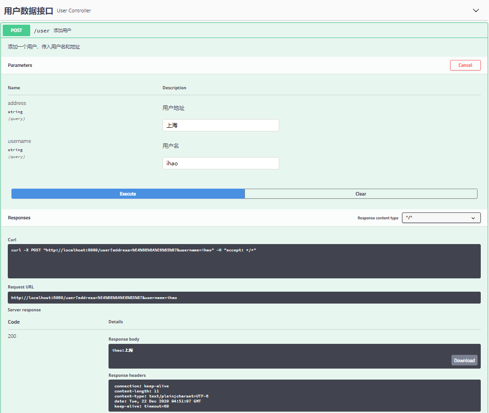

# 第十三章 企业开发

## 13.1 邮件发送

### 依赖

```xml
<dependencies>
    <dependency>
        <groupId>org.springframework.boot</groupId>
        <artifactId>spring-boot-starter-mail</artifactId>
    </dependency>
</dependencies>
```

### 配置

```properties
spring.mail.host=smtp.qq.com
spring.mail.port=587
spring.mail.username=8722xxx@qq.com
spring.mail.password=naxxxxxxfb
spring.mail.default-encoding=UTF-8
spring.mail.properties.mail.socketFactory.class=javax.net.ssl.SSLSocketFactory
spring.mail.properties.mail.debug=true

```

### 发送简单邮件

#### 服务类

```java
@Component
public class MailService {
    @Autowired
    JavaMailSender javaMailSender;
    public void sendSimpleMail(String from, String to, String cc, String subject, String content) {
        SimpleMailMessage simpleMailMessage = new SimpleMailMessage();
        simpleMailMessage.setFrom(from);
        simpleMailMessage.setTo(to);
        simpleMailMessage.setCc(cc);
        simpleMailMessage.setSubject(subject);
        simpleMailMessage.setText(content);
        javaMailSender.send(simpleMailMessage);
    }
}
```

#### 测试

```java
@SpringBootTest
class Chapter13ApplicationTests {
	@Autowired
	MailService mailService;
	@Test
	void sendMailTest() {
		mailService.sendSimpleMail("8xxx@qq.com", "5xxx@qq.com", "hzxxx@163.com", "邮件测试主题", "邮件测试内容");
	}
}
```


### 发送带附件邮件

#### 服务类

```java
@Component
public class MailService {
    @Autowired
    JavaMailSender javaMailSender;
    public void sendAttachFileMail(String from, String to, String subject, String content, File file) {
        try {
            MimeMessage message = javaMailSender.createMimeMessage();
            MimeMessageHelper helper = new MimeMessageHelper(message, true);
            helper.setFrom(from);
            helper.setTo(to);
            helper.setSubject(subject);
            helper.setText(content);
            helper.addAttachment(file.getName(), file);
            javaMailSender.send(message);
        } catch (MessagingException e) {
            e.printStackTrace();
        }
    }
}
```

#### 测试

```java
@Test
void sendAttachFileMailTest() {
    mailService.sendAttachFileMail("8qq.com", "5@qq.com",
                                   "邮件测试主题", "邮件测试内容", new File("D:\\研究.docx"));
}
```


### 发送带图片资源邮件

#### 服务类

```java
public void sendMailWithImg(String from, String to, String subject, String content, String[] srcPath, String[] resIds) {
    if (srcPath.length != resIds.length) {
        System.out.println("发送失败");
        return;
    }
    try {
        MimeMessage message = javaMailSender.createMimeMessage();
        MimeMessageHelper helper = new MimeMessageHelper(message, true);
        helper.setFrom(from);
        helper.setTo(to);
        helper.setSubject(subject);
        helper.setText(content, true);
        for (int i = 0; i < srcPath.length; i++) {
            FileSystemResource res = new FileSystemResource(new File(srcPath[i]));
            helper.addInline(resIds[i], res);
        }
        javaMailSender.send(message);
    } catch (MessagingException e) {
        e.printStackTrace();
    }
}
```

#### 测试

```java
@Test
void sendMailWithImgTest() {
    mailService.sendMailWithImg("8@qq.com", "5@qq.com",
                                "图片邮件测试主题",
                                "<div> 这是一封带图片的邮件：" +
                                "这是图片1：<div></div>" +
                                "这是图片2：<div></div>" +
                                "</div>",
                                new String[]{"D:\\1.png",
                                             "D:\\2.png"},
                                new String[]{"p01", "p02"});
}
```


### 使用 FerrMarker 构建邮件模板

#### 依赖

```xml
<dependency>
    <groupId>org.springframework.boot</groupId>
    <artifactId>spring-boot-starter-freemarker</artifactId>
</dependency>
```


#### 服务

```java
public void sendHtmlMail(String from, String to, String subject, String content) {
    try {
        MimeMessage message = javaMailSender.createMimeMessage();
        MimeMessageHelper helper = new MimeMessageHelper(message, true);
        helper.setFrom(from);
        helper.setTo(to);
        helper.setSubject(subject);
        helper.setText(content, true);
        javaMailSender.send(message);
    } catch (MessagingException e) {
        System.out.println("发送失败");
        e.printStackTrace();
    }
}
```


#### 邮件模板

src/main/resources/ftl/mailtemplate.ftl

```html
<div>邮箱激活</div>
<div>您的注册信息是：
<table border="1">
    <tr>
        <td>用户名</td>
        <td>${username}</td>
    </tr>
    <tr>
        <td>用户性别</td>
        <td>${gender}</td>
    </tr>
</table>
</div>
<div>
    <a href="http://www.baidu.com">核对无误请点击本链接激活邮箱</a>
</div>
```


#### 实体类

```java
public class User {
    private String username;
    private String gender;

}
```


#### 测试

```java
@Test
void sendHtmlMail() {
    try {
        Configuration configuration = new Configuration(Configuration.VERSION_2_3_0);
        ClassLoader loader = Chapter13Application.class.getClassLoader();
        configuration.setClassLoaderForTemplateLoading(loader, "ftl");
        Template template = configuration.getTemplate("mailtemplate.ftl");
        StringWriter mail = new StringWriter();
        User user = new User();
        user.setGender("男");
        user.setUsername("ihaozz");
        template.process(user, mail);
        mailService.sendHtmlMail("8@qq.com",
                                 "5@qq.com",
                                 "sendHtmlMail邮件测试主题",
                                 mail.toString());
    } catch (Exception e) {
        e.printStackTrace();
    }
}
```


### 使用 Thymeleaf 构建邮件模板

#### 依赖

```xml
<dependency>
    <groupId>org.springframework.boot</groupId>
    <artifactId>spring-boot-starter-thymeleaf</artifactId>
</dependency>
```


#### 模板

templates/mailtemplate.html

```html
<html lang="en" xmlns:th="http://www.thymeleaf.org">
<head>
    <meta charset="UTF-8">
    <title>邮件</title>
</head>
<body>
<div>邮箱激活</div>
<div>您的注册信息是：
    <table border="1">
        <tr>
            <td>用户名</td>
            <td th:text="${username}"></td>
        </tr>
        <tr>
            <td>用户性别</td>
            <td th:text="${gender}"></td>
        </tr>
    </table>
</div>
<div>
    <a href="http://www.baidu.com">核对无误请点击本链接激活邮箱</a>
</div>
</body>
</html>
```


#### 测试

```java
@Autowired
TemplateEngine templateEngine;
@Test
void sendHtmlMailThymeleaf() {
    Context ctx = new Context();
    ctx.setVariable("username", "ihaozz");
    ctx.setVariable("gender", "男");
    String mail = templateEngine.process("mailtemplate.html", ctx);
    mailService.sendHtmlMail("8@qq.com",
                             "5@qq.com",
                             "sendHtmlMailThymeleaf邮件测试主题",
                             mail);
}
```


## 13.2 定时任务

### @Scheduled

#### 依赖

```xml
spring-boot-starter-web
```

#### 开启定时任务

```java
@SpringBootApplication
@EnableScheduling
public class Chapter13Application {
	public static void main(String[] args) {
		SpringApplication.run(Chapter13Application.class, args);
	}
}
```


#### 配置定时任务

```java
@Component
public class MySchedule {
    @Scheduled(fixedDelay = 1000)
    public void fixedDelay() {
        System.out.println("fixedDelay:" + new Date());
    }
    @Scheduled(fixedRate = 2000)
    public void fixedRate() {
        System.out.println("fixedRate:" + new Date());
    }
    @Scheduled(initialDelay = 1000, fixedRate = 2000)
    public void initialDelay() {
        System.out.println("initialDelay:" + new Date());
    }
    @Scheduled(cron = "0 * * * * ?")
    public void cron() {
        System.out.println("cron:" + new Date());
    }
}
```

#### 测试

运行项目

```
fixedRate:Mon Dec 21 19:33:31 CST 2020
fixedDelay:Mon Dec 21 19:33:31 CST 2020
initialDelay:Mon Dec 21 19:33:32 CST 2020
fixedDelay:Mon Dec 21 19:33:32 CST 2020
fixedRate:Mon Dec 21 19:33:33 CST 2020
fixedDelay:Mon Dec 21 19:33:33 CST 2020
initialDelay:Mon Dec 21 19:33:34 CST 2020
fixedDelay:Mon Dec 21 19:33:34 CST 2020
fixedRate:Mon Dec 21 19:33:35 CST 2020
fixedDelay:Mon Dec 21 19:33:35 CST 2020
initialDelay:Mon Dec 21 19:33:36 CST 2020
... ...
```


### Quartz

#### 依赖

```xml
<dependency>
    <groupId>org.springframework.boot</groupId>
    <artifactId>spring-boot-starter-quartz</artifactId>
</dependency>
```


#### 创建Job

```java
@Component
public class MyFirstJob {
    public void sayHello() {
        System.out.println("MyFirstJob:sayHello:" + new Date());
    }
}

public class MySecondJob extends QuartzJobBean {
    private String name;
    public void setName(String name) {
        this.name = name;
    }
    @Override
    protected void executeInternal(JobExecutionContext jobExecutionContext) throws JobExecutionException {
        System.out.println("hello:" + name + ":" + new Date());
    }
}
```


#### 配置

```java
@Configuration
public class QuartzConfig {
    @Bean
    MethodInvokingJobDetailFactoryBean jobDetail1() {
        MethodInvokingJobDetailFactoryBean bean = new MethodInvokingJobDetailFactoryBean();
        bean.setTargetBeanName("myFirstJob");
        bean.setTargetMethod("sayHello");
        return bean;
    }
    @Bean
    JobDetailFactoryBean jobDetail2() {
        JobDetailFactoryBean bean = new JobDetailFactoryBean();
        bean.setJobClass(MySecondJob.class);
        JobDataMap jobDataMap = new JobDataMap();
        jobDataMap.put("name", "ihao");
        bean.setJobDataMap(jobDataMap);
        bean.setDurability(true);
        return bean;
    }
    @Bean
    SimpleTriggerFactoryBean simpleTrigger() {
        SimpleTriggerFactoryBean bean = new SimpleTriggerFactoryBean();
        bean.setJobDetail(jobDetail1().getObject());
        bean.setRepeatCount(3);
        bean.setStartDelay(1000);
        bean.setRepeatInterval(2000);
        return bean;
    }
    @Bean
    CronTriggerFactoryBean cronTrigger() {
        CronTriggerFactoryBean bean = new CronTriggerFactoryBean();
        bean.setJobDetail(jobDetail2().getObject());
        bean.setCronExpression("* * * * * ?");
        return bean;
    }
    @Bean
    SchedulerFactoryBean schedulerFactory() {
        SchedulerFactoryBean bean = new SchedulerFactoryBean();
        SimpleTrigger simpleTrigger = simpleTrigger().getObject();
        CronTrigger cronTrigger = cronTrigger().getObject();
        bean.setTriggers(simpleTrigger, cronTrigger);
        return bean;
    }
}
```


#### 运行

```java
hello:ihao:Mon Dec 21 20:18:54 CST 2020
hello:ihao:Mon Dec 21 20:18:55 CST 2020
MyFirstJob:sayHello:Mon Dec 21 20:18:55 CST 2020
hello:ihao:Mon Dec 21 20:18:56 CST 2020
hello:ihao:Mon Dec 21 20:18:57 CST 2020
MyFirstJob:sayHello:Mon Dec 21 20:18:57 CST 2020
hello:ihao:Mon Dec 21 20:18:58 CST 2020
hello:ihao:Mon Dec 21 20:18:59 CST 2020
MyFirstJob:sayHello:Mon Dec 21 20:18:59 CST 2020
hello:ihao:Mon Dec 21 20:19:00 CST 2020
hello:ihao:Mon Dec 21 20:19:01 CST 2020
MyFirstJob:sayHello:Mon Dec 21 20:19:01 CST 2020
hello:ihao:Mon Dec 21 20:19:02 CST 2020
hello:ihao:Mon Dec 21 20:19:03 CST 2020
hello:ihao:Mon Dec 21 20:19:04 CST 2020
hello:ihao:Mon Dec 21 20:19:05 CST 2020
hello:ihao:Mon Dec 21 20:19:06 CST 2020
hello:ihao:Mon Dec 21 20:19:07 CST 2020

Process finished with exit code -1
```


## 13.3 批处理

### 依赖 

```xml
<dependency>
    <groupId>org.springframework.boot</groupId>
    <artifactId>spring-boot-starter-batch</artifactId>
</dependency>
<dependency>
    <groupId>org.springframework.boot</groupId>
    <artifactId>spring-boot-starter-jdbc</artifactId>
</dependency>
<dependency>
    <groupId>com.alibaba</groupId>
    <artifactId>druid</artifactId>
    <version>1.1.10</version>
</dependency>
<dependency>
    <groupId>mysql</groupId>
    <artifactId>mysql-connector-java</artifactId>
</dependency>
```

### 配置

```properties
spring.datasource.type=com.alibaba.druid.pool.DruidDataSource
spring.datasource.url=jdbc:mysql://59.7xxx:3306/study?useUnicode=true&characterEncoding=utf8&useSSL=false&serverTimezone=Hongkong
spring.datasource.username=root
spring.datasource.password=123456
spring.datasource.schema=classpath:/org/springframework/batch/core/schema-mysql.sql
spring.batch.initialize-schema=always
spring.batch.job.enabled=false
```

### 开启注解 

```java
@SpringBootApplication
@EnableBatchProcessing
public class Chapter13Application {
	public static void main(String[] args) {
		SpringApplication.run(Chapter13Application.class, args);
	}
}
```

### 配置批处理

```java
@Configuration
public class CsvBatchJobConfig {
    @Autowired
    JobBuilderFactory jobBuilderFactory;
    @Autowired
    StepBuilderFactory stepBuilderFactory;
    @Autowired
    DataSource dataSource;
    @Bean
    @StepScope
    FlatFileItemReader<User> itemReader() {
        FlatFileItemReader<User> reader = new FlatFileItemReader<>();
        reader.setLinesToSkip(1);
        reader.setResource(new ClassPathResource("data.csv"));
        reader.setEncoding("utf-8");
        reader.setLineMapper(new DefaultLineMapper<User>(){{
            setLineTokenizer(new DelimitedLineTokenizer(){{
                setNames("id", "username", "address", "gender");
                setDelimiter(",");
            }});
            setFieldSetMapper(new BeanWrapperFieldSetMapper<User>(){{
                setTargetType(User.class);
            }});
        }});
        return reader;
    }
    @Bean
    JdbcBatchItemWriter jdbcBatchItemWriter() {
        JdbcBatchItemWriter writer = new JdbcBatchItemWriter();
        writer.setDataSource(dataSource);
        writer.setSql("insert into user(id,username,address,gender) " +
                "values(:id,:username,:address,:gender)");
        writer.setItemSqlParameterSourceProvider(new BeanPropertyItemSqlParameterSourceProvider<>());
        return writer;
    }
    @Bean
    Step csvStep() {
        return stepBuilderFactory.get("csvStep")
                .<User, User>chunk(2)
                .reader(itemReader())
                .writer(jdbcBatchItemWriter())
                .build();
    }
    @Bean
    Job csvJob() {
        return jobBuilderFactory.get("csvJob")
                .start(csvStep())
                .build();
    }
}
```

### 实体类

```java
public class User {
    private Integer id;
    private String username;
    private String address;
    private String gender;
}
```

### 建表

```sql
CREATE TABLE `user` (
	`id` INT(11) NOT NULL AUTO_INCREMENT,
	`username` VARCHAR(32) NOT NULL DEFAULT '' COMMENT '姓名',
	`address` VARCHAR(64) NOT NULL DEFAULT '' COMMENT '地址',
	`gender` VARCHAR(16) NOT NULL DEFAULT '' COMMENT '性别',	
	PRIMARY KEY (`id`) USING BTREE
)
ENGINE=InnoDB
AUTO_INCREMENT=1;
```

### 控制层

```java
@RestController
public class HelloController {
    @Autowired
    JobLauncher jobLauncher;
    @Autowired
    Job job;
    @GetMapping("/hello")
    public void hello() {
        try {
            jobLauncher.run(job, new JobParametersBuilder().toJobParameters());
        } catch (Exception e) {
            e.printStackTrace();
        }
    }
}
```

### 测试

访问：http://localhost:8080/hello


## 13.4 Swagger 2

### 依赖

```xml
<dependency>
    <groupId>io.springfox</groupId>
    <artifactId>springfox-swagger2</artifactId>
    <version>2.9.2</version>
</dependency>
<dependency>
    <groupId>io.springfox</groupId>
    <artifactId>springfox-swagger-ui</artifactId>
    <version>2.9.2</version>
</dependency>
```

### 配置类

```java
@Configuration
@EnableSwagger2
public class SwagerConfig {
    @Bean
    Docket docket() {
        return new Docket(DocumentationType.SWAGGER_2)
                .select()
                .apis(RequestHandlerSelectors.basePackage("top.huzhenhao.chapter13.controller"))
                .paths(PathSelectors.any())
                .build().apiInfo(new ApiInfoBuilder()
                        .description("接口测试文档")
                        .contact(new Contact("ihao",
                                "https://huzhenhao.top",
                                "hzh_aj@163.com"))
                        .version("v1.0")
                        .title("API 测试文档")
                        .license("Apache2.0")
                        .licenseUrl("http://www.apache.org/licenses/LICENSE-2.0")
                        .build());
    }
}
```


### 控制层接口

```java
@RestController
@Api(tags = "用户数据接口")
public class UserController {
    @ApiOperation(value = "查询用户", notes = "根据id查询用户")
    @ApiImplicitParam(paramType = "path", name = "id", value = "用户id", readOnly = true)
    @GetMapping("/user/{id}")
    public String getUserById(@PathVariable Integer id) {
        return "/user/" + id;
    }

    @ApiResponses({
            @ApiResponse(code = 200, message = "删除成功"),
            @ApiResponse(code = 500, message = "删除失败")
    })
    @ApiOperation(value = "删除用户", notes = "通过id删除用户")
    @DeleteMapping("/user/{id}")
    public Integer deleteUserById(@PathVariable Integer id) {
        return id;
    }

    @ApiOperation(value = "添加用户", notes = "添加一个用户，传入用户名和地址")
    @ApiImplicitParams({
            @ApiImplicitParam(paramType = "query", name = "username", value = "用户名", readOnly = true, defaultValue = "ihao"),
            @ApiImplicitParam(paramType = "query", name = "address", value = "用户地址", readOnly = true, defaultValue = "上海")
    })
    @PostMapping("/user")
    public String addUser(@RequestParam String username, @RequestParam String address) {
        return username + ":" + address;
    }

    @ApiOperation(value = "修改用户", notes = "修改用户，传入用户信息")
    @PutMapping("/user")
    public String updateUser(@RequestBody User user) {
        return user.toString();
    }

    @GetMapping("/ignore")
    @ApiIgnore
    public void ignoreMethod(){}
}
```

### 实体类

```java
@ApiModel(value = "用户实体类", description = "用户信息描述类")
public class User {
    private Integer id;
    @ApiModelProperty(value = "用户名")
    private String username;
    @ApiModelProperty(value = "用户地址")
    private String address;
    private String gender;
}
```

### 运行

http://localhost:8080/swagger-ui.html





## 13.5 数据校验

### 普通校验

#### 依赖

```xml
<dependency>
    <groupId>org.springframework.boot</groupId>
    <artifactId>spring-boot-starter-validation</artifactId>
</dependency>
```

#### 配置校验

src/main/resources/ValidationMessages.properties

```properties
user.name.size=用户名长度介于5到10个字符之间
user.address.notnull=用户地址不能为空
user.age.size=年龄输入不正确
user.email.notnull=邮箱不能为空
user.email.pattern=邮箱格式不正确
```

#### 配置实体类

```java
public class User {
    private Integer id;
    @Size(min = 5, max = 10, message = "{user.name.size}")
    private String username;
    @NotNull(message = "{user.address.notnull}")
    private String address;
    @DecimalMin(value = "1", message = "{user.age.size}")
    @DecimalMax(value = "200", message = "{user.age.size}")
    private Integer age;
    @Email(message = "{user.email.pattern}")
    @NotNull(message = "{user.email.notnull}")
    private String email;
}
```

#### 控制层

```java
@PostMapping("/adduser")
public List<String> addUser(@Validated User user, BindingResult result) {
    List<String> errors = new ArrayList<>();
    if (result.hasErrors()) {
        List<ObjectError> addErrors = result.getAllErrors();
        for (ObjectError error : addErrors) {
            errors.add(error.getDefaultMessage());
        }
    }
    return errors;
}
```

#### 测试

post http://localhost:8080/adduser


http://localhost:8080/adduser?username=ihao&address=上海&email=123


### 分组校验

#### 分组接口

```java
public interface ValidationGroup1 { }
public interface ValidationGroup2 { }
```

#### 添加分组信息

```java
public class User {
    private Integer id;
    @Size(min = 5, max = 10, message = "{user.name.size}", groups = ValidationGroup1.class)
    private String username;
    @NotNull(message = "{user.address.notnull}", groups = ValidationGroup2.class)
    private String address;
    @DecimalMin(value = "1", message = "{user.age.size}")
    @DecimalMax(value = "200", message = "{user.age.size}")
    private Integer age;
    @Email(message = "{user.email.pattern}")
    @NotNull(message = "{user.email.notnull}", groups = {ValidationGroup1.class, ValidationGroup2.class})
    private String email;
}
```

#### 指定校验分组

```java
@PostMapping("/adduser")
public List<String> addUser(@Validated(ValidationGroup2.class) User user, BindingResult result) {
    List<String> errors = new ArrayList<>();
    if (result.hasErrors()) {
        List<ObjectError> addErrors = result.getAllErrors();
        for (ObjectError error : addErrors) {
            errors.add(error.getDefaultMessage());
        }
    }
    return errors;
}
```

#### 测试

只验证 ValidationGroup2，即用户地址、邮箱是否为空


### 校验注解

javax.validation.constraints

