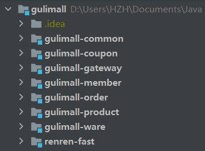

# 环境


## 使用Vagrant快速创建Linux虚拟机

### 安装VirtualBox

### 使用vagrant安装centos

```bash
vagrant init centos/7
vagrant up 启动
vagrant ssh 登陆
vagrant reload 重启
```


*在有 Vagrantfile 文件的目录下启动*

### 网络配置

在 Vagrantfile 配置文件中进行网络设置： `config.vm.network "private_network", ip: "192.168.56.10"`

可相互 Ping 通


*虚拟机环境配置有点低，后续用腾讯云继续*


## Linux环境安装Docker

[docker笔记](https://huzhenhao.top/book/%E6%8A%80%E8%83%BD%E6%A0%91/Docker.html)


## Docker 安装 Mysql

### 安装

```bash
sudo docker pull mysql:5.7

# --name指定容器名字 -v目录挂载 -p指定端口映射  -e设置mysql参数 -d后台运行
sudo docker run -p 3306:3306 --name mysql \
-v /mydata/mysql/log:/var/log/mysql \
-v /mydata/mysql/data:/var/lib/mysql \
-v /mydata/mysql/conf:/etc/mysql \
-e MYSQL_ROOT_PASSWORD=root \
-d mysql:5.7
```

```bash
[root@VM-0-16-centos ~]# docker ps
CONTAINER ID   IMAGE       COMMAND                  CREATED          STATUS          PORTS                               NAMES
c153877c52a5   mysql:5.7   "docker-entrypoint.s…"   38 seconds ago   Up 37 seconds   0.0.0.0:3306->3306/tcp, 33060/tcp   mysql
```

### 设置编码

```bash
docker exec -it mysql bin/bash  # 交互模型进入容器内部
exit;

vim /mydata/mysql/conf/my.conf 
# 写入以下内容
[client]
default-character-set=utf8
[mysql]
default-character-set=utf8
[mysqld]
init_connect='SET collation_connection = utf8_unicode_ci'
init_connect='SET NAMES utf8'
character-set-server=utf8
collation-server=utf8_unicode_ci
skip-character-set-client-handshake
skip-name-resolve

docker restart mysql
```

### 尝试连接


## Docker 安装 Redis

### 安装

如果直接挂载的话docker会以为挂载的是一个目录，所以我们先创建一个文件然后再挂载，在虚拟机中。

```bash
# 在虚拟机中
mkdir -p /mydata/redis/conf
touch /mydata/redis/conf/redis.conf

docker pull redis

docker run -p 6379:6379 --name redis \
-v /mydata/redis/data:/data \
-v /mydata/redis/conf/redis.conf:/etc/redis/redis.conf \
-d redis redis-server /etc/redis/redis.conf

# 直接进去redis客户端。
docker exec -it redis redis-cli
```

### 配置

默认是不持久化的。在配置文件中输入appendonly yes，就可以 aof 持久化了。

```bash
vim /mydata/redis/conf/redis.conf
# 插入下面内容
appendonly yes

docker restart redis
```


## 开发环境和环境安装配置

### maven

在settins中配置阿里云镜像，配置jdk1.8。安装插件lombok，mybatisX。

### vsCode

下载vsCode用于前端管理系统。在vsCode里安装插件。

- Auto Close Tag
- Auto Rename Tag
- Chinese
- ESlint
- HTML CSS Support
- HTML Snippets
- JavaScript ES6
- Live Server
- open in brower
- Vetur

### git

https://gitee.com/ihaozz/gulimall

### 项目结构创建




