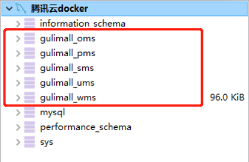
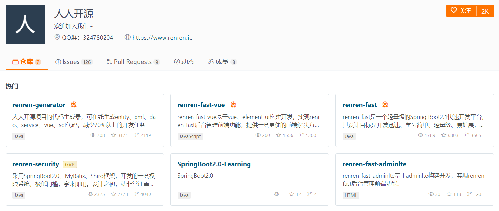
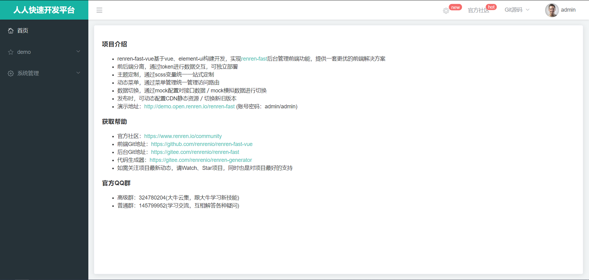
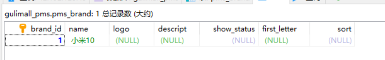
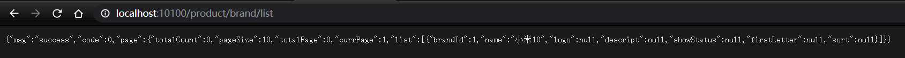

# 快速开发


## 数据库初始化




## 人人开源搭建后台管理系统



### 运行 renren-fast 项目

1. 修改配置文件`application-dev.yml`，数据库连接相关
2. 运行 `RenrenApplication`
3. 访问 http://localhost:8080/renren-fast/ ，成功

### 运行 renren-fast-vue 前端项目

1. 安装前端环境：nodejs， npm包等

2. 配置npm 镜像仓库

   ```bash
   node -v
   npm config set registry http://registry.npm.taobao.org/
   ```

   

3. 安装项目依赖和运行项目

   ```bash
   npm install
   npm run dev
   ```

   

4. 访问 http://localhost:8001/     账户 admin/admin 

   

5. 

### 运行 renren-generator 生成代码

1. 配置文件
2. 运行，逆向生成
3. 下载生成的代码放到项目中
4. 解决一些包依赖的错误


## 配置、测试基本CRUD共功能

### 整合 Mybatis-Plus

1. 导入依赖

   ```xml
   <dependency>
       <groupId>com.baomidou</groupId>
       <artifactId>mybatis-plus-boot-starter</artifactId>
       <version>3.2.0</version>
   </dependency>
   ```


2. 配置数据源

    1. 导入数据库驱动

    ```xml
    <!--mysql驱动-->
    <!-- https://mvnrepository.com/artifact/mysql/mysql-connector-java -->
    <dependency>
    <groupId>mysql</groupId>
    <artifactId>mysql-connector-java</artifactId>
    <version>8.0.17</version>
    </dependency>
    ```

    2. 配置数据源 `application.yml`

    ```yml
    #配置数据源相关信息
    spring:
    datasource:
    username: root
    password: root
    url: jdbc:mysql://42.192.123.45:3306/gulimall_pms?useUnicode=true&characterEncoding=UTF-8&serverTimezone=Asia/Shanghai
    driver-class-name: com.mysql.cj.jdbc.Driver

    server:
    port: 10100
    ```

3. 配置 Mybatis-Plus：

    1. 使用 @MapperScan("com.ihao.gulimall.product.dao") 注解

    2. 告诉 Mybatis-Plus，sql映射文件位置

    ```yml
    mybatis-plus:
    mapper-locations: classpath:/mapper/**/*.xml  # 文件映射
    global-config:
    db-config:
    id-type: auto  # 主键自增
    ```

### 测试

#### 测试 Service

   ```java
@RunWith(SpringRunner.class)
@SpringBootTest
public class GulimallProductApplicationTests {
    @Autowired
    BrandService brandService;
    @Test
    public void contextLoads() {
        BrandEntity brandEntity = new BrandEntity();
        brandEntity.setName("小米10");
        brandService.save(brandEntity);
        System.out.println("保存成功！");
    }
}
   ```

   

#### 测试 Control 

http://localhost:10100/product/brand/list

