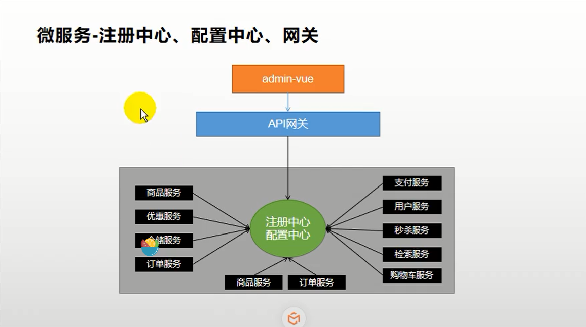
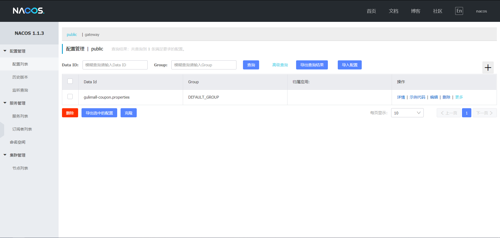
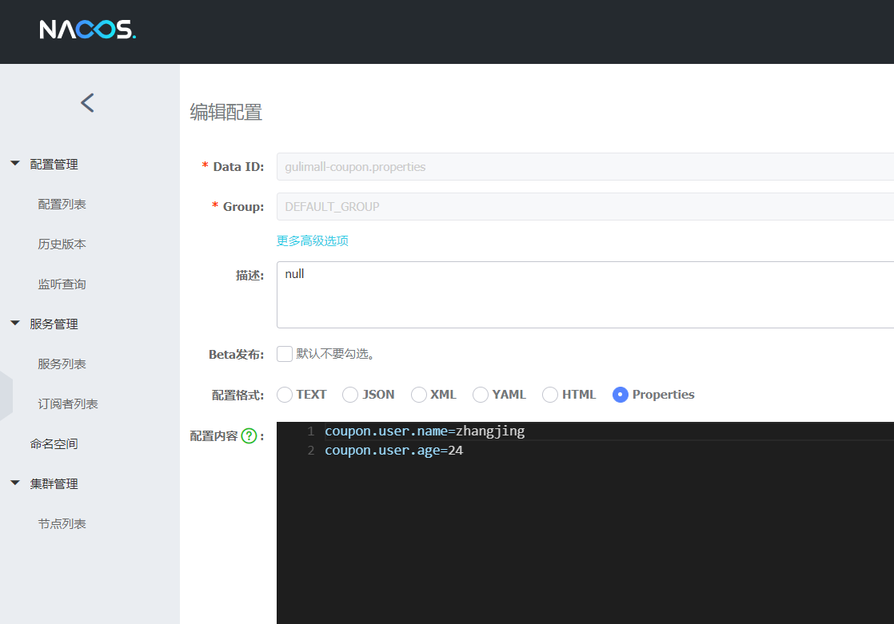
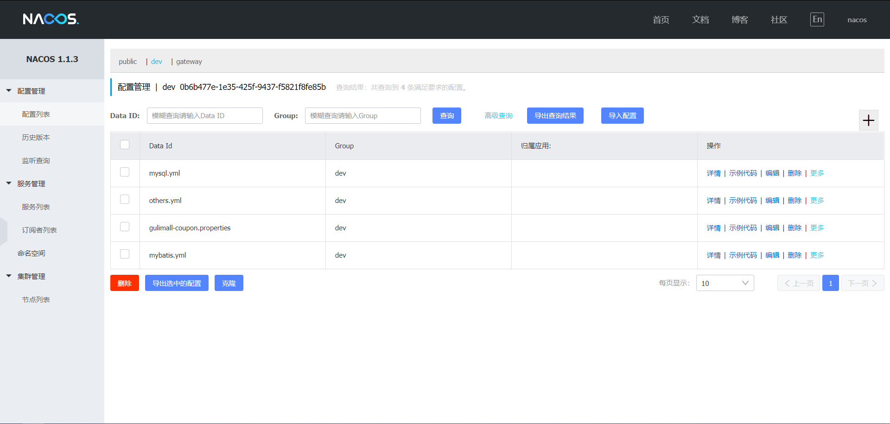
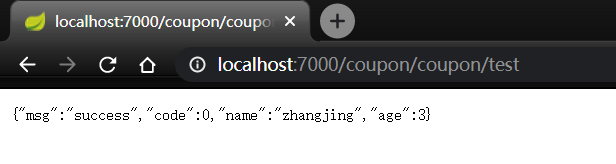

# 分布式组件




## [Spring Cloud Alibaba](https://spring.io/projects/spring-cloud-alibaba)

https://github.com/alibaba/spring-cloud-alibaba

### [Nacos 作为注册中心](https://github.com/alibaba/spring-cloud-alibaba/blob/master/spring-cloud-alibaba-examples/nacos-example/nacos-config-example/readme.md)

1. 依赖

   ```xml
   <dependency>
       <groupId>com.alibaba.cloud</groupId>
       <artifactId>spring-cloud-starter-alibaba-nacos-config</artifactId>
   </dependency>
   ```

2. 配置 `gulimall-coupon/src/main/resources/application.yml`

   ```yml
     cloud:
       nacos:
         discovery:
           server-addr: 127.0.0.1:8848
     application:
       name: gulimall-coupon  # 服务名
   ```

3. 使用 @EnableDiscoveryClient 注解开启服务注册与发现功能

4. 测试

   1. 启动 Nocas：运行 `D:\nacos\bin\startup.cmd`

   2. 启动应用

   3. 访问 http://localhost:8848/nacos   账户：nacos/nacos

      

### Feign声明式远程调用

#### 引入 OpenFeign

```xml
<dependency>
    <groupId>org.springframework.cloud</groupId>
    <artifactId>spring-cloud-starter-openfeign</artifactId>
</dependency>
```

#### 编写一个接口

`gulimall-member/src/main/java/com/ihao/gulimall/member/feign/CouponFeignService.java`

```java
// 在接口里声明@FeignClient("gulimall-coupon")他是一个远程调用客户端且要调用coupon服务
@FeignClient("gulimall-coupon")
public interface CouponFeignService {
    @RequestMapping("coupon/coupon/member/list")
    R memberCoupons();
}
```

`gulimall-coupon/src/main/java/com/ihao/gulimall/coupon/controller/CouponController.java`

```java
// 要调用coupon服务的/coupon/coupon/member/list方法
@RequestMapping("/member/list")
public R memberCoupons(){
    CouponEntity couponEntity = new CouponEntity();
    couponEntity.setCouponName("满100减50");
    return R.ok().put("coupons", Arrays.asList(couponEntity));
}
```


#### 开启远程调用功能 

@EnableFeignClients，要指定远程调用功能放的基础包

#### 测试

访问 http://localhost:8000/member/member/coupons

```json
{"msg":"success","code":0,"coupons":[{"id":null,"couponType":null,"couponImg":null,"couponName":"满100减50","num":null,"amount":null,"perLimit":null,"minPoint":null,"startTime":null,"endTime":null,"useType":null,"note":null,"publishCount":null,"useCount":null,"receiveCount":null,"enableStartTime":null,"enableEndTime":null,"code":null,"memberLevel":null,"publish":null}],"member":{"id":null,"levelId":null,"username":null,"password":null,"nickname":"zhangsan","mobile":null,"email":null,"header":null,"gender":null,"birth":null,"city":null,"job":null,"sign":null,"sourceType":null,"integration":null,"growth":null,"status":null,"createTime":null}}
```


### [Nacos作为注册中心](https://github.com/alibaba/spring-cloud-alibaba/blob/master/spring-cloud-alibaba-examples/nacos-example/nacos-config-example/readme.md)

#### 依赖

```xml
<!--        服务注册/发现-->
<dependency>
    <groupId>com.alibaba.cloud</groupId>
    <artifactId>spring-cloud-starter-alibaba-nacos-discovery</artifactId>
</dependency>
```

#### 配置 

##### 配置文件

gulimall-coupon/src/main/resources/bootstrap.properties  # 规定这个命名

```properties
spring.application.name=gulimall-coupon
spring.cloud.nacos.config.server-addr=127.0.0.1:8848
```

application.properties

```properties
coupon.user.name=zhangjing
coupon.user.age=18
```

##### 配置中心 配置管理 

​	添加数据集（data id）gulimall-coupon.properties（应用名+properties，默认规则）

​	添加配置



##### 动态获取配置

添加注解 

```
@RefreshScope：动态获取并刷新
@Value("${配置项的名}")
```

#### 代码

```java
@Value("${coupon.user.name}")
private String name;
@Value("${coupon.user.age}")
private Integer age;
@RequestMapping("/test")
public R test(){
    System.out.print("name" + name);
    System.out.print("age" + age.toString());
    return R.ok().put("name", name).put("age", age);
}
```

#### 访问

http://localhost:7000/coupon/coupon/test

```json
{"msg":"success","code":0,"name":"zhangjing","age":24}  # 配置中心的优先级更高
```

#### 配置中心进阶

在nacos浏览器中还可以配置：

- 命名空间：用作配置隔离。（一般每个微服务一个命名空间）

  - 默认public。默认新增的配置都在public空间下

  - 开发、测试、开发可以用命名空间分割。properties每个空间有一份。

  - 在bootstrap.properties里配置（测试完去掉，学习不需要）

    ```properties
    # 可以选择对应的命名空间 # 写上对应环境的命名空间ID
    spring.cloud.nacos.config.namespace=b176a68a-6800-4648-833b-be10be8bab00
    ```

  - 也可以为每个微服务配置一个命名空间，微服务互相隔离

- 配置集：一组相关或不相关配置项的集合。

- 配置集ID：类似于配置文件名，即Data ID

- 配置分组：默认所有的配置集都属于DEFAULT_GROUP。双十一，618，双十二

  ```properties
  # 更改配置分组
  spring.cloud.nacos.config.group=DEFAULT_GROUP
  ```

最终方案：每个微服务创建自己的命名空间，然后使用配置分组区分环境（dev/test/prod）

#### 加载多配置集



bootstrap.properties

```properties
spring.application.name=gulimall-coupon
spring.cloud.nacos.config.server-addr=127.0.0.1:8848
spring.cloud.nacos.config.namespace=0b6b477e-1e35-425f-9437-f5821f8fe85b
spring.cloud.nacos.config.group=dev

spring.cloud.nacos.config.ext-config[0].data-id=mysql.yml
spring.cloud.nacos.config.ext-config[0].group=dev
spring.cloud.nacos.config.ext-config[0].refresh=true

spring.cloud.nacos.config.ext-config[1].data-id=mybatis.yml
spring.cloud.nacos.config.ext-config[1].group=dev
spring.cloud.nacos.config.ext-config[1].refresh=true

spring.cloud.nacos.config.ext-config[2].data-id=others.yml
spring.cloud.nacos.config.ext-config[2].group=dev
spring.cloud.nacos.config.ext-config[2].refresh=true
```




### 网关 Gateway 

#### 新建 Gateway 项目

#### 开启服务注册发现

#### 配置

1. ```properties
   # application.properties
   spring.cloud.nacos.discovery.server-addr=127.0.0.1:8848
   spring.application.name=gulimall-gateway
   server.port=88
   ```

2. ```properties
   # bootstrap.properties
   spring.application.name=gulimall-gateway
   spring.cloud.nacos.config.server-addr=127.0.0.1:8848
   spring.cloud.nacos.config.namespace=700afab7-17cc-4494-a75c-7b90d57b39e5  # 配置Nacos的注册中心地址
   ```

#### 测试路由

配置路由

```properties
spring:
  cloud:
    gateway:
      routes:
        - id: baidu_route
          uri: https://www.baidu.com
          predicates:
            - Query=url, baidu

        - id: qq_route
          uri: https://www.qq.com
          predicates:
            - Query=url, qq
```

访问 http://localhost:88/?url=baidu 跳转到 baidu.com