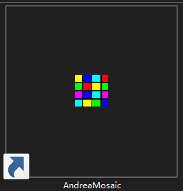

# 记录一些好用的软件  
以防换电脑后忘了名

## mathpix_snipping_tool

写论文生成公式神器，word 转 latex 等，甚至可以直接截图识别

## TranslucetTB

把Windows的状态栏变成透明的小工具

## Dynamic theme

Windows应用商店里的，换壁纸软件，壁纸来源Bing 每日一张，质量还行。

## Ventoy

装系统用的，不用写系统盘了，放镜像文件就可。

## AndreaMosaic

用很多图片生成马赛克大图。

## Another Redis Desktop Manager

一个颜值较高的 Redis [客户端](https://github.com/qishibo/AnotherRedisDesktopManager)。

## ScreenToGif

录屏生成Gif。